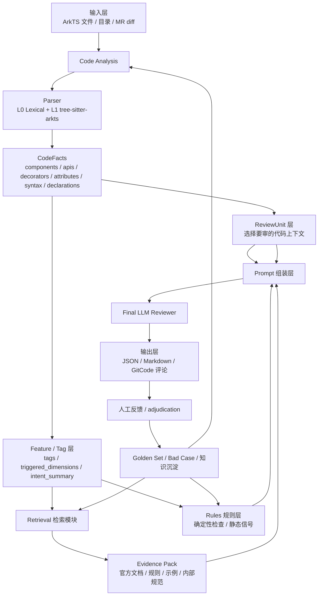

# ArkTS Code Reviewer 当前整体架构

- 文档状态: Current Snapshot
- 最后更新: 2026-07-09
- 范围: 记录当前 `arkts-code-reviewer` 已实现模块、设计中的模块、数据流和下一步推进重点
- 说明: `docs/architecture.md` 是项目早期总体设计草案；本文档描述当前真实工程状态和下一阶段落地架构。

## 1. 当前项目定位

`arkts-code-reviewer` 的目标不是单独做一个 ArkTS parser，而是做一个面向 ArkTS / ArkUI 代码的 AI code review 系统。

当前推荐架构可以概括为：

```text
ArkTS AI Code Reviewer
= Code Analysis
+ ReviewUnit
+ Retrieval Evidence
+ Deterministic Rules
+ Final LLM Reviewer
+ Evaluation Loop
```

各层职责：

| 层 | 职责 |
|---|---|
| 输入层 | 接收 ArkTS 文件、目录、MR diff 或后续 GitCode webhook |
| 代码分析层 | 解析源码，提取结构化事实和声明边界 |
| ReviewUnit 层 | 从源码或 diff 中切出适合 LLM 审查的代码上下文 |
| Feature / Tag 层 | 根据 parser facts 触发评审维度和检索路由 |
| Retrieval 层 | 根据代码特征检索官方文档、规则、内部规范、历史案例等评审依据 |
| Rules 层 | 对明确、可确定的问题做 deterministic 检查 |
| Prompt 组装层 | 把代码、facts、rules、evidence 组装成最终 LLM 输入 |
| Final LLM Reviewer | 生成最终结构化代码评审意见 |
| 输出层 | JSON source of truth、Markdown 报告、GitCode 评论 |
| 评测闭环 | parser / ReviewUnit / retrieval / LLM review 的 golden set 和人工裁决 |

## 2. 当前总体数据流



一句话理解：

```text
parser 负责看见代码事实；
ReviewUnit 负责切出要审的上下文；
Retrieval 负责找依据；
Rules 负责提供确定性信号；
Final LLM 负责结合代码、事实、依据和规则生成最终评审。
```

## 3. 已实现模块

### 3.1 Code Analysis 数据模型

核心文件：

```text
src/arkts_code_reviewer/code_analysis/models.py
```

当前核心模型：

| 模型 | 作用 |
|---|---|
| `CodeFacts` | parser 输出的结构化事实 |
| `Declaration` | struct/class/function/method/build/ui_block 边界 |
| `ReviewUnit` | 面向 LLM 的代码审查上下文单元 |
| `RetrievalUnit` | 面向检索模块的代码特征单元 |
| `RetrievalQuery` | 一次分析给检索模块的批量请求 |
| `AnalysisResult` | `review_units + retrieval_query + metadata` 的总结果 |

### 3.2 Parser L0 词法层

核心文件：

```text
src/arkts_code_reviewer/code_analysis/lexical.py
```

职责：

```text
不依赖 Node 和 tree-sitter。
通过正则、import 扫描、brace matching 提取基础 facts。
作为 L1 失败时的兜底。
```

主要输出：

```text
imports
decorators
components
apis
attributes
syntax
declarations
```

### 3.3 Parser L1 ArkTS tree-sitter 层

核心文件：

```text
src/arkts_code_reviewer/code_analysis/arkts_tree_sitter_parser.py
sidecars/arkts-parser/parse_arkts.js
third_party/tree-sitter-arkts
```

当前接入方式：

```text
Python ArktsTreeSitterParser
  -> Node sidecar parse_arkts.js
  -> npm tree-sitter-arkts
  -> AST in memory
  -> snapshot JSON
  -> Python 合并为 CodeFacts
```

注意：

```text
完整 AST 不落盘。
Node sidecar 输出的是提炼后的 snapshot JSON。
Python 最终向后续模块提供 CodeFacts。
```

当前已实现：

```text
ArkUI component expression 识别
decorator 识别
call_expression 识别
attributes 识别
struct/class/function/method/build/ui_block declaration 识别
ERROR / missing node 统计
L1 失败时降级到 L0
```

### 3.4 CodeAnalyzer 编排

核心文件：

```text
src/arkts_code_reviewer/code_analysis/analyzer.py
```

职责：

```text
1. 调 parser 生成 CodeFacts。
2. 调 ReviewUnitBuilder 生成 ReviewUnit。
3. 调 tagger 生成 tags 和 triggered_dimensions。
4. 组装 RetrievalQuery。
5. 返回 AnalysisResult。
```

默认 parser：

```python
ArktsTreeSitterParser(fallback=LexicalParser())
```

### 3.5 ReviewUnit 初版

核心文件：

```text
src/arkts_code_reviewer/code_analysis/review_units.py
```

当前能力：

```text
full 模式:
  按 struct/class 生成 ReviewUnit。

diff 模式:
  根据 hunk 行号选择覆盖它的 declaration。
  短 build 选完整 build。
  长 build 尝试选择最近 ui_block。
  找不到边界时 fallback 到 hunk 上下文窗口。

host_summary:
  包含 struct、decorators、states、lifecycle、imports。

多 hunk:
  相同 unit_ref 合并 changed_lines。
```

下一步计划：

```text
把 ReviewUnit 从“能用”升级为“可解释、可测试”：
  unit_kind
  source_span
  context_span
  selection_reason
  diagnostics
```

详细设计见：

```text
docs/code-analysis/ReviewUnit模块完整设计.md
```

### 3.6 Tagger 初版

核心文件：

```text
src/arkts_code_reviewer/code_analysis/tagger.py
```

职责：

```text
CodeFacts -> tags -> triggered_dimensions
```

当前 tags 示例：

```text
has_image
has_timer
has_subscription
has_media
has_async
has_interactive_component
has_layout
has_text_display
has_resource_ref
has_permission_request
has_state_management
has_lifecycle
has_animation
has_navigation
```

### 3.7 Parser Validation 质检旁路

核心文件：

```text
src/arkts_code_reviewer/parser_validation/
tools/run_arkts_parser_batch.py
tools/validate_parser_with_llm.py
tools/plan_parser_validation_runs.py
tools/run_glm_l1_smoke.ps1
```

职责：

```text
对 parser 输出做质量验证。
确定性批测回答 parser 能不能跑。
GLM judge 辅助发现 missing / false_positive / canonicalization / ReviewUnit boundary 疑点。
```

重要边界：

```text
GLM judge 只是质检旁路。
GLM findings 不直接进入生产评审链路。
人工确认后才沉淀 golden cases。
```

当前样本来源：

```text
tests/fixtures/arkui_ace_engine_samples.json
D:\Code\RAG-test\arkui_ace_engine
```

## 4. 设计中模块

### 4.1 Retrieval 检索模块

定位：

```text
Retrieval 不检索代码本身。
它根据 CodeFeatures / tags / host_summary / intent_summary 检索评审依据。
```

输入建议：

```json
{
  "unit_ref": "xxx@file.ets",
  "unit_kind": "method | build_method | ui_block | struct | fallback_window",
  "code_features": {
    "components": [],
    "apis": [],
    "decorators": [],
    "attributes": [],
    "tags": []
  },
  "host_summary": {
    "struct": "",
    "decorators": [],
    "states": [],
    "lifecycle": [],
    "imports": []
  },
  "intent_summary": "",
  "changed_lines": []
}
```

输出建议：

```text
Evidence Pack
  按 unit_ref 回挂 clauses。
  每条 evidence 带 source、dimension、matched_by、priority、source_path。
```

检索策略：

```text
结构化路由
+ 关键词精确召回
+ 向量语义召回
+ 规则命中
+ 权威度排序
+ token budget 裁剪
```

证据优先级建议：

```text
1. 部门内部规范
2. 官方 ArkTS / HarmonyOS 文档
3. CodeLinter / HomeCheck / ArkAnalyzer 规则
4. 团队历史 review case
5. 官方/开源示例代码
6. LLM 通用经验
```

待对齐问题：

```text
attributes 是否正式加入 CodeFeatures。
ReviewUnit.full_text 是否参与检索。
host_summary 是否进入检索。
每个 unit 返回多少条 evidence。
MR diff 下是否过滤旧代码相关依据。
```

### 4.2 Deterministic Rules 规则层

定位：

```text
对明确、可重复、误报可控的问题做规则检测。
```

适合规则层的问题：

```text
any / var
ArkTS 禁用语法
明确装饰器组合错误
deprecated API
权限声明缺失
资源 release 配对的部分高确定性场景
```

规则来源：

```text
官方 ArkTS 文档
CodeLinter
HomeCheck
ArkAnalyzer
ks-arkts-skills
团队内部规范
```

规则层不替代 LLM。

它输出的是：

```text
高可信静态信号。
```

### 4.3 Final LLM Reviewer

定位：

```text
最终代码评审员。
```

输入：

```text
ReviewUnit.full_text
changed_lines / unit_changed_lines
host_summary
CodeFacts / CodeFeatures
tags / triggered_dimensions
deterministic rule findings
retrieved Evidence Pack
output schema
```

输出建议：

```json
{
  "findings": [
    {
      "file": "...",
      "line": 42,
      "severity": "high",
      "category": "robustness",
      "problem": "...",
      "evidence": "...",
      "recommendation": "...",
      "references": ["..."],
      "confidence": "high",
      "is_diff_related": true
    }
  ]
}
```

核心原则：

```text
高严重问题必须有代码证据。
强规则问题尽量引用官方/内部规范。
建议型问题必须标注为 suggestion。
MR diff 模式默认只评论本次改动直接相关问题。
```

## 5. 文档结构

当前 docs 目录：

```text
docs/
  architecture.md
  architecture-current.md
  modules/
    code-analysis.md
    retrieval.md
    parser-validation.md
  code-analysis/
    代码分析模块架构与数据流.md
    Parser架构与结果详解.md
    Parser评测计划与记录规范.md
    ReviewUnit模块完整设计.md
    Mentor对齐问题清单-ReviewUnit与评审边界.md
```

文档关系：

| 文档 | 作用 |
|---|---|
| `docs/architecture.md` | 早期总体架构草案 |
| `docs/architecture-current.md` | 当前真实架构快照 |
| `docs/modules/code-analysis.md` | 早期代码分析模块详细设计 |
| `docs/modules/retrieval.md` | 早期检索模块详细设计 |
| `docs/modules/parser-validation.md` | parser validation 设计 |
| `docs/code-analysis/*.md` | 当前 Obsidian 工作区同步文档，更贴近近期讨论和实现状态 |

## 6. 当前代码状态

截至 2026-07-09：

```text
已实现:
  L0 LexicalParser
  L1 ArkTS tree-sitter parser
  Node sidecar
  CodeFacts / Declaration / ReviewUnit / RetrievalQuery 数据模型
  ReviewUnit 初版
  Tagger 初版
  Parser validation 工具链
  GLM judge 接入和测试计划工具

设计中:
  ReviewUnit 可解释化和 deterministic tests
  Retrieval 模块
  Deterministic rules registry
  Final LLM Reviewer prompt schema
  知识库索引与 Evidence Pack
```

## 7. 下一步推荐路线

### Phase 1: ReviewUnit 稳定化

```text
1. 为 ReviewUnitBuilder 增加 deterministic tests。
2. 增加 unit_kind / source_span / context_span / selection_reason。
3. 修正 host_summary 污染风险。
4. 明确 method / build / ui_block / field_region / fallback 策略。
```

### Phase 2: Retrieval 契约落地

```text
1. 扩展 CodeFeatures，加入 attributes。
2. 设计 RetrievalUnit 最小契约。
3. 设计 Evidence Pack schema。
4. 按 unit_ref 回挂检索结果。
5. 先实现规则/关键词检索，再补向量检索。
```

### Phase 3: Rules 规则层

```text
1. 从 ks-arkts-skills / HomeCheck / 官方文档抽第一批规则。
2. 建 rule registry。
3. 对 P0/P1 明确问题做 deterministic 检查。
4. 规则 findings 进入 final prompt。
```

### Phase 4: Final LLM Reviewer

```text
1. 设计结构化输出 schema。
2. Prompt 输入合并 ReviewUnit + facts + rules + evidence。
3. 先跑开源样本和人工 golden cases。
4. 人工 adjudication 反哺 bad case。
```

### Phase 5: 评测闭环

```text
1. ReviewUnit golden tests。
2. Retrieval golden set。
3. Final review accepted/rejected 记录。
4. 输出质量指标：误报率、接受率、评论数量、依据命中率。
```

## 8. 目前最关键的待决策问题

需要和 mentor 对齐：

```text
1. 第一版主要审 MR diff 还是整文件。
2. ArkTS review 维度优先级。
3. 哪些问题必须有官方/内部依据。
4. ReviewUnit 上下文粒度。
5. 旧代码问题是否评论。
6. Retrieval 是 Unit 级还是 MR 级。
7. attributes / host_summary 是否进入检索。
8. Evidence Pack topK 和证据优先级。
9. Final LLM 是否允许 suggestion。
10. 第一版验收标准是低误报还是高覆盖。
```

详细问题清单见：

```text
docs/code-analysis/Mentor对齐问题清单-ReviewUnit与评审边界.md
```

