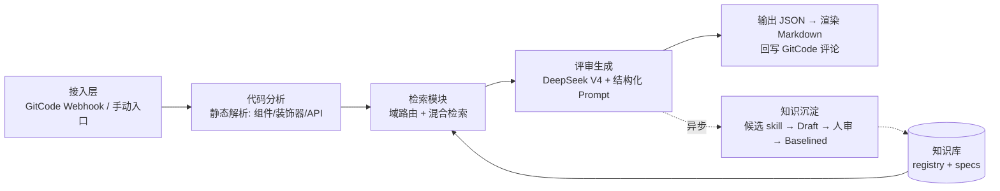
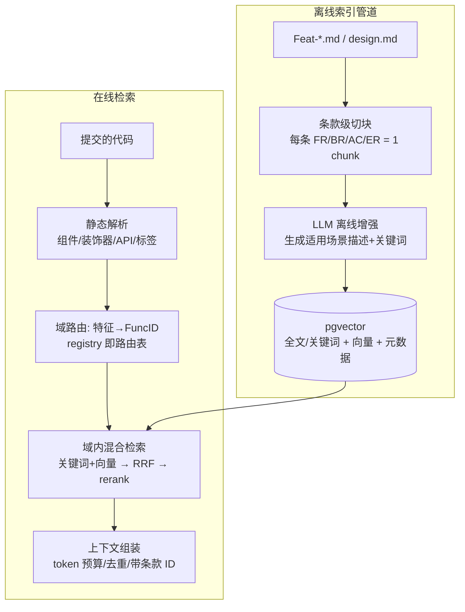

# ArkTS 代码评审系统架构设计

- 文档状态: Draft
- 最后更新: 2026-07-03
- 范围: 基于 arkui-specs 知识库与 DeepSeek V4 的 ArkTS 代码智能评审系统（RAG 架构）总体设计
- 说明: 本文档记录设计阶段达成的架构共识。实现层待定项见文末清单。

## 1. 背景与目标

部门成员向 GitCode 代码库提交 ArkTS 代码，代码质量参差不齐，且大模型对 ArkTS 语料
覆盖不足。本系统的目标：

1. 借助 DeepSeek V4，结合 arkui-specs 知识库，对提交的代码给出**有依据、可追溯**的
   针对性评审意见。
2. 在评审过程中识别优秀代码实践，经人工审核后**沉淀回知识库**，形成知识增长闭环。
3. 评价标准**配置驱动、可动态扩展**，随时间演进无需改代码。

## 1.1 仓库关系

本仓库（arkts-code-reviewer）是评审系统的主项目仓库，存放系统代码与设计文档。
arkui-specs 知识库是**外部只读数据源**，不属于本仓库：

```text
<任意工作目录>/
├── arkui-specs/           # 部门知识库 clone（只读数据源，git pull 定期同步上游）
└── arkts-code-reviewer/   # 本仓库：评审系统代码 + 文档
```

- 系统通过**配置项**（如 `KB_PATH` 环境变量/配置文件）引用知识库本地路径，
  各协作者自行 clone 知识库到任意位置，不硬编码任何机器相关路径。
- 离线索引管道从知识库读取 registry 与 spec 构建检索索引。
- 不向 arkui-specs 原仓库提交任何改动（无写权限）；知识沉淀回流产出的新 spec
  走 fork + PR 流程贡献回部门仓库。

## 2. 总体架构



处理管线：接入 → 静态分析 → 检索 → 评审生成 → 输出；知识沉淀为异步旁路。

## 3. 模块设计决策

### 3.1 部署形态与模型接入

**决策：中心化服务 + LLM Gateway 抽象层。**

- 核心评审逻辑全部部署在服务端（内网），保证知识库索引统一、评审标准版本一致、
  API 密钥不下发到个人机器。
- 模型调用统一经过 **LLM Gateway 抽象层**：检索、Prompt 组装、输出解析与模型接入
  方式完全解耦。DeepSeek V4 走公有云 API 还是内网私有化部署尚未确定，该决策
  **不阻塞架构**，未来只需替换 Gateway 实现。
- 决策依据优先级：安全合规 > 成本。部门代码属于核心资产，接入方式需先过公司安全
  政策评估。
- PoC 阶段可使用公有云 API + 脱敏样例代码/开源 OpenHarmony 代码验证全链路，与
  私有化部署决策并行推进。

### 3.2 接入层

**决策：双适配器，共用同一评审管线。**

| 入口 | 触发方式 | 评审粒度 | 结果呈现 |
|---|---|---|---|
| GitCode Webhook | MR 创建/更新自动触发 | diff 增量（改动 hunk + 上下文扩展） | 行内评论 + 总评回写 MR（bot 账号） |
| 手动入口（CLI/网页） | 开发者主动提交 | 整文件/目录 | 评审报告 |

- 服务内部走队列异步处理，应对 MR 高峰。
- diff 模式的 Prompt 需额外注入被改函数的完整上下文，避免模型只看片段误判。

### 3.3 评价维度体系

**决策：核心维度 + 条件触发扩展维度，全部配置驱动（`dimensions.yaml`）。**

核心维度（每次必查）：

1. 规范符合度 —— 是否符合知识库中已 Baselined 的 spec 条款
2. ArkTS 语言特性 —— 状态管理装饰器（@State/@Link/@ObservedV2 等）、生命周期
3. 性能 —— 布局层级、重渲染范围、LazyForEach、资源释放
4. 可维护性 —— 组件拆分、复用
5. 健壮性 —— 异常与边界处理

条件维度（按代码特征标签触发）：

| 维度 | 触发条件示例 | 关注点 |
|---|---|---|
| API 兼容性 | 总是 | deprecated API、minAPIVersion、Inner 接口误用 |
| 资源与内存管理 | has_image / has_subscription / has_timer | 监听器解注册、图片释放、定时器清理 |
| 并发与异步 | has_async / has_taskpool | 主线程阻塞、异步错误处理 |
| 无障碍 | 有交互组件 | accessibilityText、语义标签 |
| 多设备适配 | 有布局代码 | 折叠屏/平板响应式、栅格、深色模式 |
| 国际化 | 有用户可见文本 | 硬编码字符串 vs `$r()`、RTL |
| 安全 | 涉及权限/数据/输入 | 权限申请合理性、敏感数据处理 |
| 可测性与 DFX | 总是（低权重） | 日志规范、可测试性 |

`dimensions.yaml` 条目结构（示例）：

```yaml
- id: DIM-06
  title: 资源与内存管理
  trigger: has_image OR has_subscription OR has_timer   # 标签表达式
  kb_scope: ['04-01', '03-08']    # 关联知识库功能域前缀
  severity_weight: high
  prompt_fragment: "检查监听器是否解注册、图片资源是否释放..."
  status: Active        # Draft / Active / Deprecated
  since: v1.2
```

可维护性保障（核心原则：**维度是数据，不是代码**）：

- 标签器、Prompt 组装器、报告渲染器三个引擎只读配置，不感知具体维度。
  新增维度 = 改 YAML + 补知识库条款，通常零代码。
- `dimensions.yaml` 进 git 版本化；每份评审报告记录所用配置版本，历史可追溯。
- 新维度先 `status: Draft` 跑影子评审（输出但不计入结论），观察误报率达标后转
  `Active`；废弃维度标 `Deprecated` 不删。
- 治理流程复用 registry 的 status 生命周期模式。

### 3.4 检索模块

**决策：条款级切块 + 离线增强 + 规则域路由 + 混合检索；
Retriever 接口抽象 + pgvector 单后端。**

> 详细设计见独立模块文档：[docs/modules/retrieval.md](modules/retrieval.md)



离线索引：

- **条款级切块**：每条 FR/BR/AC/ER 一个 chunk，元数据带
  `func_id / feat_id / rule_id / status`。不做整文件切块。
- **LLM 离线增强**：为每条款生成"适用场景描述 + 涉及组件/API/装饰器关键词"，
  解决规范文本（中文）与查询（代码特征）之间的词汇鸿沟。离线一次性完成。
- 索引构建挂 CI：registry 或 spec 变更自动增量重建（`tools/generate_search_index.py`
  形式，延续本仓库生成器惯例）。

在线检索四步：

1. **静态解析**：提取 import 组件、装饰器、API 调用 → 特征标签
   （与维度触发器共用同一套标签）。
2. **域路由**：特征 → FuncID 规则映射表（registry 即路由表），规则未命中时
   fallback 到语义分类。规则路由可解释、可修，准确率优先于纯向量。
3. **域内细检索**：关键词精确匹配（API/组件名，权重高）+ 向量召回，
   RRF 融合后过 reranker 取 top-K。`Baselined` 条款优先，`Draft` 降权，
   `Deprecated` 排除。
4. **上下文组装**：按触发维度分配 token 配额（保证每个命中维度都有条款），
   去重合并，每条带条款 ID 供 Prompt 强制引用。

存储后端：

- **Retriever 抽象接口**（`index(chunks)` / `search(query, filters)` / `delete(ids)`），
  上层逻辑只依赖接口。
- **pgvector 单后端**：一个 PostgreSQL 同时提供关键词/全文检索、向量检索
  （HNSW）、元数据过滤，从百级平滑扩展到百万级条款，无运行时切换点。
  评审记录、维度配置、golden set 同库共存，边际运维成本趋零。
- 中文分词规避策略：关键词匹配走离线增强生成的英文标识符关键词字段 + pg_trgm，
  不依赖中文分词扩展。
- 若未来规模远超预期，按接口实现新后端并以**影子对比**方式切换（新旧并行、
  对比 recall 一致性），不做硬切。
- 明确否决的替代方案：阈值双栈（SQLite FTS5 + Faiss / pgvector 按规模切换）——
  双实现双测试矩阵 + 高风险迁移点，成本高于收益。

动态增长应对（沉淀回流带来的持续写入）：

- 增量索引：新 spec 合入只重建该文档的 chunks。
- 原子切换：新索引版本构建完成后按版本号+别名切换，检索不读半成品。
- 索引版本记录：每份评审报告记录所用索引版本。
- golden set 同步增长：新沉淀条款要求作者附 1 个"应命中案例"。

质量度量：

- **golden set**：人工标注 30~50 组"代码样例 → 应命中条款"，跑 recall@K 回归。
  检索调优必须以此为依据。
- bad case 回流：评审被人工纠错时记录，反哺路由规则与增强字段。
- 一套针对 Retriever 接口的**契约测试**，任何后端实现必须全部通过。

性能原则：时延大头是 LLM 调用（秒级），检索不是瓶颈，不为检索性能过度设计。
对相同文件 hash + 索引版本做检索结果缓存。

### 3.5 评审生成（Prompt 原则）

已达成的原则（详细 Prompt 结构待专项设计）：

- **强制引用**：每条意见必须引用知识库条款 ID（FuncID/FeatID/FR-xx/BR-xx）；
  无依据的意见降级标注为"模型建议"。引用 ID 机器可校验（必须真实存在），
  用于压制幻觉。
- Prompt = 固定骨架 + 命中维度的 `prompt_fragment` 动态拼装 + 检索条款 +
  严格输出 schema + few-shot 示例。
- 可选两阶段策略：先列检查点、再逐项评审，提升覆盖率。

### 3.6 输出格式

**决策：JSON 为 source of truth，Markdown 是渲染视图。**

- JSON 结构化字段：文件/行号/维度/严重级/引用条款 ID/问题描述/修改建议。
  供机器校验、统计分析、回写 GitCode 行内评论。
- Markdown 报告由 JSON 渲染生成，面向人阅读。
- 报告记录元数据：维度配置版本、索引版本、模型版本，保证历史评审可追溯。

### 3.7 知识沉淀回流（原则已定，流程待专项设计）

- "好代码"判定 = 客观信号（MR 已合入、CR 通过、无缺陷回归）+ 模型初评 +
  **领域 owner 人工审核门禁**，不允许模型自由判断。
- 沉淀流程复用 registry 的 status 生命周期：模型提取候选 → `Draft` →
  人审 → `Baselined`。
- 优点提取角度与评审维度共用同一张 `dimensions.yaml`，保证"评"与"沉淀"
  口径一致。

## 4. 决策状态清单

已定（架构决策）：

- [x] 中心化服务 + LLM Gateway 抽象（DeepSeek 接入方式解耦）
- [x] GitCode MR 自动（diff）+ 手动入口（整文件）双适配器
- [x] 核心 5 维 + 条件触发扩展维度，`dimensions.yaml` 配置驱动 + 影子灰度
- [x] 条款级切块 + LLM 离线增强 + 规则域路由 + 混合检索
- [x] Retriever 接口抽象 + pgvector 单后端
- [x] 增量索引 + 原子版本切换 + golden set 回归机制
- [x] JSON 为主、Markdown 渲染的输出格式
- [x] 沉淀回流的人审门禁与 status 生命周期原则

待定（实现/调优阶段决定）：

| 待定项 | 决策方式 |
|---|---|
| DeepSeek V4 接入方式（公有云 API vs 内网私有化） | 公司安全合规评估 |
| Embedding 模型选型（候选 bge-m3，需确认内网可部署性） | golden set 对比实验 |
| Reranker 取舍与选型 | 消融实验（有无 rerank 的 recall 对比） |
| top-K、token 预算、维度配额 | golden set 调参 |
| spec Markdown 条款解析器（历史文档格式不完全统一） | 对真实文档迭代 |
| 离线增强 Prompt 与产出字段 schema | 与沉淀模块 Prompt 一起设计 |
| golden set 首批 30~50 条人工标注 | 需领域同事投入，建议尽早排期 |
| 知识沉淀回流的完整流程 | 专项设计（下一步） |
| 评审 Prompt / 沉淀提取 Prompt 详细结构 | 专项设计（下一步） |

## 5. 下一步

1. 知识沉淀回流完整流程设计（候选提取 → Draft → 人审 → 入库 → 索引增量更新）。
2. 两段 Prompt（评审 / 沉淀提取）详细结构设计。
3. golden set 首批标注排期。
4. DeepSeek 接入方式的安全合规评估。
