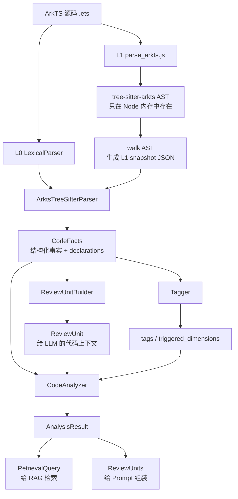

# Parser 架构与结果详解

> [!summary]
> 这份文档解释 `arkts-code-reviewer` 当前 parser 到底做什么、输出什么、哪些代码细节会被保留、哪些细节不会被结构化，以及这些结果如何进入 `ReviewUnit` 和后续 AI code review。
>
> 相关文档：[[代码分析模块架构与数据流]]、[[Parser评测计划与记录规范]]

## 1. 先给结论

当前 parser 不只是提取组件名。

它的结果分三层：

```text
第一层：CodeFacts
  结构化事实包。
  包括 imports、components、apis、decorators、attributes、symbols、syntax、declarations。

第二层：Declaration
  代码结构边界。
  包括 struct / class / function / method / build_method / builder / ui_block 的起止行和原文。

第三层：AnalysisResult
  面向后续评审链路的组织结果。
  包括 ReviewUnit、RetrievalQuery、metadata。
```

它能提取“代码里出现了什么”，也能保留“代码原文片段在哪里”。但是它目前还不是完整语义分析器，不会把所有业务逻辑都转换成可计算的中间表示。

因此要理解当前 parser，最重要的是这句话：

```text
parser 负责提取事实和边界；
ReviewUnit 负责把正确的代码原文和上下文交给 LLM；
LLM 结合原文、事实、规则和 RAG 证据判断代码好坏。
```

## 2. 当前代码文件地图

主项目：

```text
D:\Code\RAG-test\arkts-code-reviewer
```

核心 parser 文件：

| 文件 | 作用 |
|---|---|
| `D:\Code\RAG-test\arkts-code-reviewer\src\arkts_code_reviewer\code_analysis\models.py` | 定义 `CodeFacts`、`Declaration`、`ReviewUnit`、`RetrievalQuery` 等数据模型 |
| `D:\Code\RAG-test\arkts-code-reviewer\src\arkts_code_reviewer\code_analysis\lexical.py` | L0 词法 parser，正则 + import 扫描 + brace matching |
| `D:\Code\RAG-test\arkts-code-reviewer\src\arkts_code_reviewer\code_analysis\arkts_tree_sitter_parser.py` | L1 Python adapter，调用 Node sidecar，并把 L1 snapshot 合并成 `CodeFacts` |
| `D:\Code\RAG-test\arkts-code-reviewer\sidecars\arkts-parser\parse_arkts.js` | Node sidecar，调用 `tree-sitter-arkts`，遍历 AST，输出 JSON snapshot |
| `D:\Code\RAG-test\arkts-code-reviewer\src\arkts_code_reviewer\code_analysis\review_units.py` | 根据 parser 的 declaration 边界生成 `ReviewUnit` |
| `D:\Code\RAG-test\arkts-code-reviewer\src\arkts_code_reviewer\code_analysis\tagger.py` | 根据 `CodeFacts` 推导 tags 和 triggered dimensions |
| `D:\Code\RAG-test\arkts-code-reviewer\src\arkts_code_reviewer\code_analysis\analyzer.py` | 总入口，把 parser、ReviewUnit、tags、RetrievalQuery 串起来 |
| `D:\Code\RAG-test\arkts-code-reviewer\src\arkts_code_reviewer\code_analysis\arkts_lexicon.py` | 内置 ArkUI 组件、属性、装饰器、API alias 词表 |

第三方 ArkTS grammar：

```text
D:\Code\RAG-test\arkts-code-reviewer\third_party\tree-sitter-arkts
```

实际运行用的 npm 包：

```text
D:\Code\RAG-test\arkts-code-reviewer\sidecars\arkts-parser\node_modules\tree-sitter-arkts
```

## 3. 总体数据流



注意：

```text
AST 不会作为文件落盘。
落到 Python 里的不是完整 AST，而是 sidecar 提炼后的 snapshot JSON。
生产链路里最终流转的是 CodeFacts / ReviewUnit / RetrievalQuery。
```

## 4. Parser 分层

### 4.1 L0：词法兜底层

入口类：

```python
class LexicalParser:
    def parse(self, source: str, path: str) -> CodeFacts
```

L0 的特点：

```text
不依赖 Node。
不依赖 tree-sitter。
任何环境都应该能跑。
主要靠正则、import 扫描、括号匹配。
```

L0 负责粗提取：

| 字段 | L0 如何获得 |
|---|---|
| `imports` | 正则扫描 `import ... from ...` |
| `decorators` | 正则扫描 `@State`、`@Component` 等 |
| `components` | 调用名 + `DEFAULT_ARKUI_COMPONENTS` 白名单 |
| `apis` | dotted call + import alias 映射 |
| `attributes` | `.onClick()`、`.width()` 这类链式调用 |
| `syntax` | `async`、`await`、`Promise`、`try/catch` 等关键词 |
| `declarations` | `struct/class/method/build` 的粗边界 |

L0 的主要价值：

```text
作为保底层。
当 L1 sidecar 不存在、Node 失败、tree-sitter 报错时，生产链路仍然能跑。
```

### 4.2 L1：ArkTS tree-sitter 结构层

入口类：

```python
class ArktsTreeSitterParser:
    def parse(self, source: str, path: str) -> CodeFacts
```

L1 的调用流程：

```text
1. Python 先调用 LexicalParser，拿到 L0 fallback facts。
2. Python 启动 node。
3. node 执行 sidecars/arkts-parser/parse_arkts.js。
4. parse_arkts.js 从 stdin 读取 ArkTS 源码。
5. tree-sitter-arkts 在 Node 内存中生成 AST。
6. parse_arkts.js 递归遍历 AST。
7. sidecar 输出 snapshot JSON 到 stdout。
8. Python 读取 snapshot，合并进 L0 facts。
9. 返回 parser_layer = L1 的 CodeFacts。
```

L1 比 L0 更擅长：

```text
识别 ArkUI DSL。
识别 ui_block。
识别更准确的 struct / class / method / build_method 边界。
统计 ERROR / missing nodes。
从 AST 节点识别 call_expression、decorator、await_expression 等。
```

如果 L1 失败：

```text
parser_layer = "parse_degraded"
warnings 里记录 arkts_tree_sitter_failed。
facts 保留 L0 输出。
```

### 4.3 L2：结构组织层

这里的 L2 不是完整语义层，而是当前工程里的组织层。

入口类：

```python
class CodeAnalyzer:
    def analyze_file(...)
    def analyze_files(...)
```

它做三件事：

```text
1. parser.parse() -> CodeFacts
2. ReviewUnitBuilder -> ReviewUnit
3. derive_tags / trigger_dimensions -> RetrievalQuery
```

也就是说：

```text
L0/L1 负责“看见代码事实”。
L2 负责“把这些事实整理成后续模块能消费的形态”。
```

## 5. CodeFacts：parser 的核心结果

定义位置：

```text
D:\Code\RAG-test\arkts-code-reviewer\src\arkts_code_reviewer\code_analysis\models.py
```

当前结构：

```python
@dataclass
class CodeFacts:
    path: str
    imports: list[ImportInfo]
    components: set[str]
    apis: set[str]
    decorators: set[str]
    attributes: set[str]
    symbols: set[str]
    syntax: set[str]
    declarations: list[Declaration]
    parser_layer: ParserLayer
    warnings: list[str]
```

字段解释：

| 字段 | 含义 | 示例 | 对 review 的意义 |
|---|---|---|---|
| `path` | 当前源码路径 | `pages/animation.ets` | 定位文件 |
| `imports` | import 信息 | `@ohos.router` as `router` | API canonical 化、host summary |
| `components` | ArkUI 组件调用 | `Column`, `Row`, `Button`, `Image` | 触发布局、交互、图片等维度 |
| `apis` | 系统/API 调用 | `router.back`, `$r`, `setInterval` | 触发导航、资源、异步、权限等维度 |
| `decorators` | ArkTS/ArkUI 装饰器 | `@Entry`, `@Component`, `@State` | 判断状态管理、组件类型 |
| `attributes` | ArkUI modifier / 属性 | `onClick`, `animation`, `rotate`, `height` | 判断交互、动画、布局细节 |
| `symbols` | 符号名、声明名 | `AnimationExample.build` | 生命周期、边界、host 信息 |
| `syntax` | 语法特征 | `arrow_fn`, `async_fn`, `await_expr` | 判断异步、异常处理等维度 |
| `declarations` | 结构边界和原文 | `struct`, `build_method`, `ui_block` | 生成 ReviewUnit 的基础 |
| `parser_layer` | 解析层级 | `L0`, `L1`, `parse_degraded` | 质量追踪 |
| `warnings` | 解析异常或降级信息 | `error_nodes: 3` | 质量追踪、评测 |

### 5.1 components 不是全部代码细节

`components` 只是 parser facts 的一个字段。

它回答的是：

```text
这段 ArkTS / ArkUI 代码用了哪些 UI 组件？
```

例如：

```text
Column
Row
Button
ImageAnimator
Navigation
```

它不回答：

```text
这个 Button 点击后的业务逻辑是否正确？
这个状态更新是否有竞态？
这个 if 分支是否遗漏异常场景？
```

这些要靠 ReviewUnit 的代码原文 + LLM/规则来判断。

### 5.2 apis 和 attributes 的边界

当前约定：

```text
apis:
  尽量只放真正的系统/API 调用。
  例如 router.back、image.createPixelMap、setInterval。

attributes:
  放 ArkUI modifier / 链式属性。
  例如 onClick、animation、rotate、margin、height。

components:
  放 ArkUI 组件。
  例如 Button、Column、Image。
```

这很重要。

因为如果把 `Button().onClick().margin().animation()` 这种 UI 链整条都塞进 `apis`，后续检索和规则会被污染。

当前更合理的拆法是：

```text
components: Button
attributes: onClick, margin, animation
apis:      回调里面真正调用的 router.back 等
```

### 5.3 syntax 能提取到什么细节

当前 `syntax` 是轻量语法标签，不是完整 AST IR。

已支持的常见项：

```text
async_fn
await_expr
promise
arrow_fn
try_catch
```

它能告诉后续模块：

```text
这段代码涉及异步。
这段代码有 await。
这段代码有 try/catch。
```

但它目前不会完整表达：

```text
if 条件树
for 循环变量
赋值左右值关系
数据流
控制流图
调用图
类型推断
```

这些属于后续更重的静态分析层，不属于当前 parser 第一目标。

## 6. Declaration：parser 保留代码细节的关键

如果只看 `components/apis/decorators`，parser 看起来像“只提关键词”。

但当前 parser 还有一个非常关键的字段：

```python
declarations: list[Declaration]
```

定义：

```python
@dataclass
class Declaration:
    kind: Literal[
        "struct", "class", "function", "method",
        "build_method", "builder", "ui_block"
    ]
    name: str
    qualified_name: str
    span: SourceSpan
    parent_name: str | None
    text: str
```

各字段含义：

| 字段 | 含义 |
|---|---|
| `kind` | 声明类型，例如 `struct`、`method`、`build_method`、`ui_block` |
| `name` | 当前声明名，例如 `build`、`Column` |
| `qualified_name` | 带父级的名字，例如 `AnimationExample.build.Column` |
| `span` | 起止行列 |
| `parent_name` | 父级声明名 |
| `text` | 这个声明对应的源码原文 |

这意味着 parser 不只是提取组件，还保留了结构化的源码边界。

例如一个 `struct` declaration 可以包含：

```text
span.start_line = 17
span.end_line = 105
text = 从第 17 行到第 105 行的完整 struct 原文
```

这个 `text` 后续会进入 `ReviewUnit.full_text`。

所以代码实现细节不是都被转成 JSON 字段，而是通过 `Declaration.text` 和 `ReviewUnit.full_text` 保留下来，让 LLM 直接阅读。

## 7. ReviewUnit 和 parser 的关系

`ReviewUnit` 不是 parser 本身，但它依赖 parser 的边界结果。

关系如下：

```text
源码
  -> parser
  -> CodeFacts.declarations
  -> ReviewUnitBuilder
  -> ReviewUnit
  -> LLM review prompt
```

`ReviewUnit` 定义：

```python
@dataclass
class ReviewUnit:
    file: str
    unit_symbol: str
    unit_ref: str
    full_text: str
    changed_lines: list[int]
    file_changed_lines: list[int]
    unit_changed_lines: list[int]
    host_summary: HostSummary
    context_degraded: bool
```

字段解释：

| 字段 | 含义 |
|---|---|
| `file` | 文件路径 |
| `unit_symbol` | 当前评审单元符号，比如 `AnimationExample` |
| `unit_ref` | 唯一引用，格式通常是 `symbol@file` |
| `full_text` | 真正给 LLM 看的代码原文 |
| `changed_lines` | diff 模式下文件级改动行 |
| `file_changed_lines` | 文件内改动行 |
| `unit_changed_lines` | 映射到 review unit 内部的改动行 |
| `host_summary` | 宿主 struct/class 摘要 |
| `context_degraded` | 是否退化为 hunk 窗口 |

### 7.1 full 模式

当前 full 模式逻辑：

```text
如果 parser 提取到 struct/class：
  每个 struct/class 生成一个 ReviewUnit。

如果没有 struct/class：
  退化为整个文件或 hunk 窗口。
```

### 7.2 diff 模式

diff 模式逻辑：

```text
1. 输入 hunk 行号。
2. 从 declarations 中找覆盖该 hunk 的声明。
3. 优先选择最小、最合适的 declaration。
4. 如果 hunk 落在超长 build() 中，尝试选择更小的 ui_block。
5. 如果找不到声明边界，fallback 为 hunk 上下文窗口。
```

这就是为什么 ReviewUnit 很重要：

```text
parser 负责提供边界候选；
ReviewUnitBuilder 负责决定“到底给 LLM 哪段代码”。
```

如果 ReviewUnit 太小，LLM 会缺上下文。

如果 ReviewUnit 太大，LLM 会被噪声干扰，也浪费 token。

如果 ReviewUnit 选错，LLM 会审错对象。

## 8. RetrievalQuery：给 RAG 的 parser 结果

`CodeAnalyzer` 最终还会生成 `RetrievalQuery`：

```python
@dataclass(frozen=True)
class RetrievalQuery:
    mr_context: MrContext
    units: list[RetrievalUnit]
```

其中 `RetrievalUnit`：

```python
@dataclass(frozen=True)
class RetrievalUnit:
    unit_ref: str
    code_features: CodeFeatures
    intent_summary: str
```

`CodeFeatures` 当前字段：

```python
@dataclass(frozen=True)
class CodeFeatures:
    components: list[str]
    decorators: list[str]
    apis: list[str]
    tags: list[str]
```

注意：

```text
CodeFacts 有 attributes。
但当前 CodeFeatures 暂时没有 attributes 字段。
```

这说明：

```text
attributes 当前会参与 tag 推导。
但不会直接作为 RetrievalUnit.code_features 输出。
```

后续如果发现 RAG 检索需要精确识别 `animation / rotate / onClick / objectFit` 这类属性，可以考虑把 `attributes` 加入 `CodeFeatures`。

## 9. Tagger：把 parser facts 变成 review 维度

文件：

```text
D:\Code\RAG-test\arkts-code-reviewer\src\arkts_code_reviewer\code_analysis\tagger.py
```

核心函数：

```python
derive_tags(facts: CodeFacts) -> set[str]
trigger_dimensions(tags: set[str]) -> list[str]
```

例子：

```text
components 包含 Button
  -> has_interactive_component
  -> 触发交互 / 无障碍相关维度

components 包含 Column / Row
  -> has_layout
  -> 触发布局 / 多设备适配相关维度

decorators 包含 @State
  -> has_state_management
  -> 触发状态管理相关维度

apis 包含 router.back
  -> has_navigation
  -> 触发导航相关维度
```

当前 tags 示例：

```text
has_interactive_component
has_layout
has_navigation
has_state_management
```

当前 triggered dimensions 示例：

```text
DIM-01
DIM-02
DIM-03
DIM-04
DIM-05
DIM-08
DIM-09
DIM-12
```

这些维度目前只是 ID，后续需要和 `dimensions.yaml` / 规则库 / RAG 路由正式对齐。

## 10. 一个真实样本的当前输出

样本文件：

```text
D:\Code\RAG-test\arkui_ace_engine\examples\Animation\entry\src\main\ets\pages\animation.ets
```

相对路径：

```text
examples/Animation/entry/src/main/ets/pages/animation.ets
```

当前 `CodeAnalyzer().analyze_file(...)` 输出摘要：

```text
parser_layer = L1

triggered_dimensions =
  DIM-01
  DIM-02
  DIM-03
  DIM-04
  DIM-05
  DIM-08
  DIM-09
  DIM-12

unit_ref =
  AnimationExample@examples/Animation/entry/src/main/ets/pages/animation.ets

components =
  Button
  Column
  Row

decorators =
  @Component
  @Entry
  @State

apis =
  router.back

tags =
  has_interactive_component
  has_layout
  has_navigation
  has_state_management

review_unit_symbol =
  AnimationExample

review_text_lines =
  89

host_summary =
  struct: AnimationExample
  decorators: @Component, @Entry
  states:
    @State widthSize: number = 250
    @State heightSize: number = 100
    @State rotateAngle: number = 0
    @State count: number = 0
    @State flag: boolean = true
    @State bg: Color = Color.Blue
  lifecycle: []
  imports:
    @ohos.router
```

这说明：

```text
parser 不只知道用了 Button / Column / Row。
它还知道这个文件是 @Entry / @Component，使用了 @State，调用了 router.back。
ReviewUnit 还保留了 89 行完整 struct 原文，供 LLM 阅读代码细节。
```

## 11. parser 到底能不能提取代码细节

答案要分两层。

### 11.1 能结构化提取的细节

当前已经能结构化提取：

```text
import 来源
ArkUI 组件
ArkUI modifier / 属性
系统 API 调用
装饰器
状态管理装饰器
生命周期方法名
async / await / Promise / try-catch 等语法信号
struct / class / method / build / ui_block 边界
每个 declaration 的源码原文
```

这些足够支撑：

```text
review 维度触发
RAG 检索路由
ReviewUnit 切分
host_summary 构造
高确定性规则初筛
LLM prompt 上下文压缩
```

### 11.2 目前不会完整结构化的细节

当前 parser 暂时不会完整结构化：

```text
变量赋值链
if / else 条件语义
循环体语义
异常路径完整性
跨函数调用关系
跨文件调用图
资源 acquire / release 配对
权限声明与 API 使用的跨文件对应
状态更新是否竞态
业务逻辑是否健壮
类型推断和泛型约束
```

这些不是不重要，而是应该由后续层处理：

```text
简单高确定性模式 -> deterministic rules
跨文件关系 -> code graph / ArkAnalyzer / HomeCheck 后续接入
业务语义判断 -> LLM reviewer
官方依据 -> RAG evidence
```

### 11.3 代码实现细节如何进入 LLM

代码实现细节主要通过 `ReviewUnit.full_text` 进入 LLM。

也就是说：

```text
parser 不需要把每个 if / for / assignment 都转成 JSON。
它只需要把正确的代码片段、host summary、facts 和 tags 准备好。
LLM 直接读 full_text 判断代码质量。
```

这也是为什么 ReviewUnit 对最终 review 很关键。

## 12. 当前 parser 的能力边界

当前 parser 适合做：

```text
1. ArkTS / ArkUI 文件结构识别。
2. ReviewUnit 切分的边界基础。
3. 组件 / API / 装饰器 / 属性 / syntax facts 提取。
4. review 维度触发。
5. RAG 检索 query 的特征输入。
6. GLM parser-validation 的被测对象。
```

当前 parser 不适合单独做：

```text
1. 完整静态缺陷检测。
2. 类型检查。
3. 完整控制流 / 数据流分析。
4. 跨文件调用图。
5. 业务逻辑正确性判断。
6. 最终代码好坏评分。
```

所以项目架构里 parser 的定位应该是：

```text
评审上下文生产器，而不是最终 reviewer。
```

## 13. 当前已知改进点

### 13.1 attributes 应考虑进入 CodeFeatures

当前：

```text
CodeFacts.attributes 有 onClick / animation / rotate。
CodeFeatures 没有 attributes。
```

影响：

```text
tags 可以用 attributes。
但 RAG 检索看不到 attributes 明细。
```

后续建议：

```text
给 CodeFeatures 增加 attributes 字段。
这样 animation / rotate / objectFit / onClick 能参与知识检索。
```

### 13.2 host_summary 需要继续收敛

当前 `host_summary` 会包含：

```text
struct
decorators
states
lifecycle
imports
```

后续要重点保证：

```text
不要把别的 struct/class 的 decorators、states、lifecycle 混进来。
不要从字符串或注释里误提 @Param / @State。
```

### 13.3 ReviewUnit 边界比 facts 更影响 LLM 质量

facts 漏一个属性，可能只是少触发一个细分维度。

ReviewUnit 边界错了，LLM 看到的上下文就错了。

后续 parser validation 要继续重点看：

```text
ReviewUnit 是否 too_small。
ReviewUnit 是否 too_large。
ReviewUnit 是否 wrong_symbol。
build() 中是否能切到合适 ui_block。
diff hunk 是否能映射到正确 unit_changed_lines。
```

### 13.4 不要让 parser 变成重型静态分析器

从当前资料调研看，ArkAnalyzer / HomeCheck 这类工具可以做更重的静态分析。

我们的 parser 当前更适合保持轻量：

```text
快速。
稳定。
可降级。
能给 LLM 和 RAG 生产高质量上下文。
```

复杂分析后续可以作为独立 signal 接入，而不是塞进 parser。

## 14. 面向最终 AI Review 的使用方式

最终 prompt 不应该只给 LLM 一串 parser facts。

更合理的输入是：

```text
1. ReviewUnit.full_text
   当前要审的代码原文。

2. changed_lines / unit_changed_lines
   告诉 LLM 哪些行是改动重点。

3. host_summary
   告诉 LLM 当前代码所在 struct 的状态变量、装饰器、imports、生命周期。

4. CodeFacts / CodeFeatures
   告诉 LLM parser 确定性看见了哪些组件/API/装饰器/tags。

5. deterministic rules findings
   告诉 LLM 已经命中的高确定性规则。

6. RAG evidence
   给出官方文档、规范条款、规则依据。
```

最终评审判断：

```text
由 LLM 结合代码原文 + facts + rules + evidence 完成。
```

## 15. 一句话心智模型

```text
CodeFacts 是 parser 看见的结构化事实；
Declaration 是 parser 切出来的源码边界；
ReviewUnit 是真正要交给 LLM 审的代码单元；
RetrievalQuery 是交给 RAG 找规范证据的特征请求；
最终 code review 不是 parser 单独完成，而是 parser + rules + RAG + LLM 合作完成。
```

