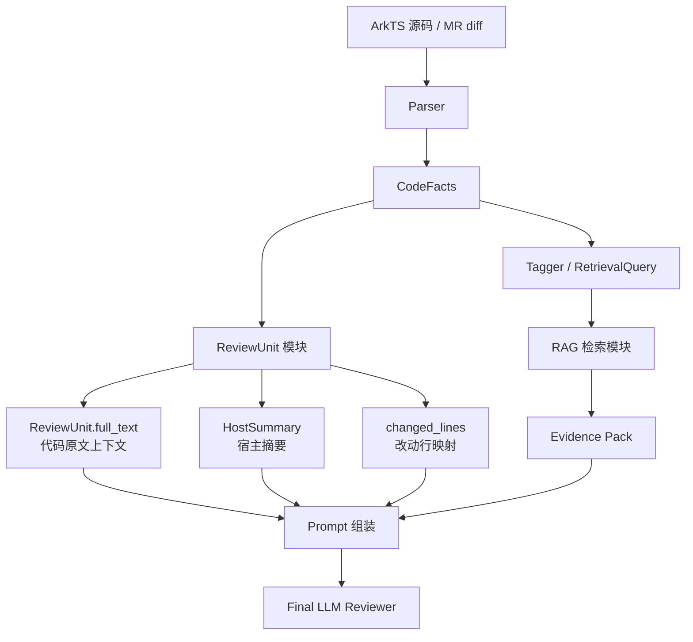
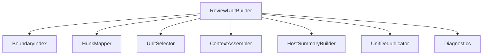

# ReviewUnit 模块完整设计

> [!summary]
> `ReviewUnit` 模块的核心职责是：从完整 ArkTS 源码或 MR diff 中，切出最适合 LLM 审查的代码上下文单元。
>
> 它不负责判断代码好坏，不负责检索知识库，也不负责最终生成评审意见。它是 parser 和最终 LLM reviewer 之间的“上下文切片器”。
>
> 相关文档：[[Parser架构与结果详解]]、[[代码分析模块架构与数据流]]、[[Parser评测计划与记录规范]]

## 1. 一句话定位

```text
ReviewUnit = 面向 AI code review 的代码上下文单元。
```

parser 负责看见代码事实和边界：

```text
components / apis / decorators / attributes / declarations / span / text
```

ReviewUnit 负责决定：

```text
这次评审到底把哪一段代码交给 LLM 看？
这段代码周围需要补哪些宿主上下文？
diff 的改动行如何映射到这个代码单元内部？
如果 parser 边界不可靠，要如何降级？
```

因此 ReviewUnit 的质量会直接影响最终 LLM review 的质量。

## 2. 在系统中的位置



关键边界：

```text
parser:
  提供 declarations 和 facts。

ReviewUnit:
  选择并组织代码上下文。

Retrieval:
  根据 parser features 找知识文档。

Final LLM Reviewer:
  根据 ReviewUnit 原文、parser facts、规则、RAG 证据生成最终评审。
```

## 3. 当前实现基线

当前文件：

```text
D:\Code\RAG-test\arkts-code-reviewer\src\arkts_code_reviewer\code_analysis\review_units.py
```

当前核心类：

```python
class ReviewUnitBuilder:
    def build_full_units(...)
    def build_diff_units(...)
```

当前已经支持：

```text
full 模式：
  按 struct / class 生成 ReviewUnit。
  如果没有 struct / class，则 fallback 到整文件窗口。

diff 模式：
  根据 hunk 行号选择覆盖它的 declaration。
  hunk 在 build_method 且 build 很长时，尝试选择最近 ui_block。
  找不到 declaration 时，fallback 到 hunk 上下文窗口。

host_summary：
  提供 struct、decorators、states、lifecycle、imports。

多 hunk：
  同一个 unit_ref 会合并 changed_lines。
```

当前不足：

```text
1. ReviewUnit 缺少 unit_kind / source_span / selection_reason 等调试字段。
2. 所有逻辑集中在 ReviewUnitBuilder，后续复杂后会难测。
3. host_summary 当前容易受全文件 facts 污染，需要更强的宿主级过滤。
4. @State 字段区、超长 struct、多个相邻 ui_block 等场景还没有清晰策略。
5. ReviewUnit 还没有独立 golden tests，质量目前依赖人工观察和 GLM parser-validation。
```

## 4. 设计目标

### 4.1 必须做到

```text
1. 对 full / diff 两种模式产出稳定 ReviewUnit。
2. 每个 ReviewUnit 能解释自己为什么被选中。
3. 每个 ReviewUnit 都保留可定位的源码范围。
4. diff 模式能准确映射改动行。
5. parser 边界不可靠时能安全降级。
6. 不依赖 GLM，也能通过 deterministic tests 验证。
```

### 4.2 暂不追求

```text
1. 不做完整静态语义分析。
2. 不做调用图、控制流图、数据流图。
3. 不判断代码好坏。
4. 不直接检索知识库。
5. 不把超大文件一次性塞给 LLM。
```

## 5. 输入与输出

### 5.1 输入

ReviewUnit 模块输入：

```text
path:
  文件路径。

source:
  完整新版文件源码。

facts:
  parser 输出的 CodeFacts。

mode:
  full 或 diff。

hunks:
  diff 模式下的改动行区间。

config:
  max_build_lines、fallback_context_lines、max_unit_lines 等参数。
```

当前依赖的 `CodeFacts` 字段：

| 字段 | 用途 |
|---|---|
| `declarations` | 选择代码边界 |
| `imports` | 构造 host_summary |
| `decorators` | 构造 host_summary 和判断组件类型 |
| `symbols` | 判断生命周期方法 |
| `parser_layer` | 记录质量和降级状态 |
| `warnings` | 作为诊断信息 |

当前依赖的 `Declaration` 字段：

| 字段 | 用途 |
|---|---|
| `kind` | 判断 struct / method / build / ui_block 等类型 |
| `name` | 生成 unit_symbol |
| `qualified_name` | 生成 unit_ref |
| `span` | 判断 hunk 是否落在该声明中 |
| `parent_name` | 构造父子关系和 host summary |
| `text` | 生成 ReviewUnit.full_text |

### 5.2 当前输出

当前 `ReviewUnit`：

```python
@dataclass
class ReviewUnit:
    file: str
    unit_symbol: str
    unit_ref: str
    full_text: str
    changed_lines: list[int]
    file_changed_lines: list[int]
    unit_changed_lines: list[int]
    host_summary: HostSummary
    context_degraded: bool
```

字段含义：

| 字段 | 含义 |
|---|---|
| `file` | 文件路径 |
| `unit_symbol` | 当前单元符号，比如 `PhotoWall.loadImages` |
| `unit_ref` | 唯一引用，通常是 `unit_symbol@file` |
| `full_text` | 真正交给 LLM 的代码原文 |
| `changed_lines` | 文件级改动行 |
| `file_changed_lines` | 文件级改动行，和 `changed_lines` 当前接近 |
| `unit_changed_lines` | 改动行映射到 `full_text` 内部后的行号 |
| `host_summary` | 宿主 struct/class 摘要 |
| `context_degraded` | 是否因为找不到边界而降级 |

### 5.3 建议扩展输出

建议后续把 `ReviewUnit` 扩展为：

```python
@dataclass
class ReviewUnit:
    file: str
    unit_symbol: str
    unit_ref: str
    unit_kind: str
    source_span: SourceSpan
    context_span: SourceSpan
    full_text: str
    changed_lines: list[int]
    file_changed_lines: list[int]
    unit_changed_lines: list[int]
    host_summary: HostSummary
    context_degraded: bool
    selection_reason: str
    diagnostics: list[str]
```

新增字段说明：

| 字段 | 为什么需要 |
|---|---|
| `unit_kind` | 调试时知道选中的是 method、build、ui_block 还是 fallback |
| `source_span` | 当前单元的真实声明范围 |
| `context_span` | `full_text` 实际截取范围，fallback 时可能不同于 source_span |
| `selection_reason` | 解释为什么选择这个单元 |
| `diagnostics` | 记录边界异常、降级原因、合并信息 |

`unit_kind` 建议枚举：

```text
struct
class
function
method
build_method
builder
ui_block
field_region
file
fallback_window
```

## 6. 内部架构设计

当前可以先保持一个 `ReviewUnitBuilder` 类，但设计上建议拆成几个逻辑组件。



### 6.1 ReviewUnitBuilder

模块门面。

职责：

```text
1. 接收 path/source/facts/mode/hunks/config。
2. 调用 BoundaryIndex 构建声明索引。
3. full 模式走 full selection。
4. diff 模式逐 hunk selection。
5. 调用 ContextAssembler 生成 ReviewUnit。
6. 调用 UnitDeduplicator 合并重复单元。
```

外部 API：

```python
class ReviewUnitBuilder:
    def build_full_units(self, path: str, source: str, facts: CodeFacts) -> list[ReviewUnit]
    def build_diff_units(self, path: str, source: str, facts: CodeFacts, hunks: list[FileHunk]) -> list[ReviewUnit]
```

### 6.2 BoundaryIndex

把 parser 的 `declarations` 整理成可查询的边界索引。

职责：

```text
1. 按 start_line / end_line 排序。
2. 校验 span 是否合法。
3. 建立 parent -> children 关系。
4. 支持按 hunk 查询 overlapping declarations。
5. 支持查找 host struct/class。
6. 支持查找最近 ui_block。
```

建议提供：

```python
class BoundaryIndex:
    def covering(hunk: FileHunk) -> list[Declaration]
    def host_of(declaration: Declaration) -> Declaration | None
    def children_of(declaration: Declaration) -> list[Declaration]
    def nearest_ui_block(hunk: FileHunk, within: Declaration | None = None) -> Declaration | None
```

边界校验规则：

```text
span.start_line >= 1
span.end_line >= span.start_line
span.end_line <= source_line_count
text 非空
qualified_name 非空
```

不合法 declaration 不直接抛错，而是进入 diagnostics。

### 6.3 HunkMapper

把 diff hunk 映射到候选 declaration。

职责：

```text
1. 计算 hunk 覆盖的文件行。
2. 找到所有与 hunk overlap 的 declarations。
3. 计算每个 declaration 的 overlap 比例。
4. 标记 hunk 是否位于字段区、方法区、build 区或未知区。
```

建议输出：

```python
@dataclass
class HunkContext:
    hunk: FileHunk
    changed_lines: list[int]
    covering: list[Declaration]
    host: Declaration | None
    region_kind: str
```

`region_kind` 建议：

```text
method_body
build_body
builder_body
ui_block
struct_field_region
class_field_region
top_level
unknown
```

### 6.4 UnitSelector

选择最适合评审的单元。

职责：

```text
1. 接收 HunkContext。
2. 根据选择策略挑一个 declaration 或 fallback window。
3. 输出 selection_reason。
```

建议输出：

```python
@dataclass
class UnitSelection:
    declaration: Declaration | None
    unit_kind: str
    source_span: SourceSpan
    context_span: SourceSpan
    context_degraded: bool
    selection_reason: str
    diagnostics: list[str]
```

### 6.5 ContextAssembler

把 selection 转成 `ReviewUnit`。

职责：

```text
1. 根据 context_span 截取 full_text。
2. 生成 unit_symbol 和 unit_ref。
3. 映射 unit_changed_lines。
4. 加入 host_summary。
5. 附加 diagnostics。
```

### 6.6 HostSummaryBuilder

构造压缩宿主上下文。

职责：

```text
1. 找当前 unit 所属 struct/class。
2. 提取该 host 内部的状态变量。
3. 提取该 host 的组件装饰器。
4. 提取该 host 的生命周期方法。
5. 提取 imports。
```

重要原则：

```text
host_summary 必须尽量来自 host 自身文本和 host 子声明。
不要直接用全文件 decorators/symbols/states 盲目填充。
```

这是为了避免：

```text
@Observed class 被误带上别的 @Component host 信息。
字符串里的 @Param 被误识别为状态变量。
别的 struct 的 lifecycle 被混进当前 host。
```

### 6.7 UnitDeduplicator

处理多 hunk 情况。

职责：

```text
1. 相同 unit_ref 合并。
2. 合并 changed_lines / file_changed_lines / unit_changed_lines。
3. 合并 diagnostics。
4. 保持输出顺序稳定。
```

合并原则：

```text
同一个函数内多个 hunk -> 一个 ReviewUnit。
不同函数内多个 hunk -> 多个 ReviewUnit。
同一个超长 build 内相邻 ui_block -> 通常保持独立，除非上下文高度重叠。
```

## 7. 核心选择策略

### 7.1 full 模式

full 模式用于：

```text
手动入口整文件评审。
没有 diff 的样本评测。
```

第一版策略：

```text
1. 如果文件有 struct/class：
     每个 struct/class 生成一个 ReviewUnit。

2. 如果没有 struct/class，但有 top-level function：
     每个 top-level function 生成一个 ReviewUnit。

3. 如果没有任何 declaration：
     生成 file/fallback ReviewUnit，覆盖整文件。
```

大文件后续策略：

```text
如果 struct/class 超过 max_unit_lines：
  第一阶段仍保留整个 struct。
  第二阶段再按 method/build 子单元切分。
```

不建议第一版就做复杂拆分，因为 full 模式更容易产生大量 unit，先稳定 diff 模式更重要。

### 7.2 diff 模式总原则

diff 模式用于 MR review，是最关键路径。

总原则：

```text
给 LLM 的上下文要比 diff hunk 大，但不能无边界地吞整个文件。
```

优先级：

```text
1. 普通 method/function/builder 改动 -> 完整 method/function/builder。
2. 短 build() 改动 -> 完整 build()。
3. 超长 build() 改动 -> 最近 ui_block。
4. struct/class 字段区改动 -> field_region 或 host struct 的轻量上下文。
5. 找不到边界 -> hunk 上下文窗口。
```

### 7.3 普通方法改动

场景：

```text
hunk 落在普通 method/function 内。
```

策略：

```text
选择最小覆盖 hunk 的 method/function/builder。
```

原因：

```text
普通函数通常是完整行为单元。
LLM 需要看到完整参数、局部变量、控制流、返回值和异常处理。
```

selection_reason 示例：

```text
hunk is covered by method PhotoWall.loadImages; selected complete method
```

### 7.4 @Builder 函数改动

场景：

```text
hunk 落在 @Builder 函数内。
```

策略：

```text
优先选择完整 builder。
如果 builder 超长，后续可以按内部 ui_block 切。
```

原因：

```text
@Builder 通常代表一段可复用 UI 构建逻辑。
完整 builder 比单个 UI 组件更能保留上下文。
```

### 7.5 短 build() 改动

场景：

```text
hunk 落在 build() 内。
build_method 行数 <= max_build_lines。
```

策略：

```text
选择完整 build_method。
```

默认阈值：

```text
max_build_lines = 160
```

原因：

```text
短 build() 通常可以整体阅读。
拆得太碎会丢失布局层级、状态变量引用和组件关系。
```

### 7.6 超长 build() 改动

场景：

```text
hunk 落在 build() 内。
build_method 行数 > max_build_lines。
```

策略：

```text
1. 在覆盖 hunk 的 declarations 中查找 ui_block。
2. 选择最小覆盖 hunk 的 ui_block。
3. 如果 ui_block 仍然过长，可继续选择更小的子 ui_block。
4. 找不到 ui_block，则退回 build_method 或 fallback window。
```

原因：

```text
超长 build() 全量给 LLM 噪声太大。
ArkUI 组件子树通常是更自然的审查单位。
```

selection_reason 示例：

```text
hunk is inside long build method; selected nearest ui_block Column
```

### 7.7 状态字段区改动

场景：

```text
hunk 改动 @State / @Local / @Param / @Link 等字段声明。
```

问题：

```text
字段本身通常没有 method declaration。
如果直接选整个 struct，可能过大。
如果只给字段行，又缺少引用上下文。
```

第一版建议：

```text
如果 hunk 落在 struct/class 内，但不落在任何 method/build/ui_block：
  选择 host struct/class。
  但 selection_reason 标记为 struct_field_region。
```

第二版增强：

```text
生成 field_region ReviewUnit：
  包含字段区上下文。
  包含 host_summary。
  可选附加引用该字段的最近 method/build 摘要。
```

暂时不建议第一版就做字段引用分析，因为需要更多 parser/静态分析能力。

### 7.8 顶层 import 改动

场景：

```text
hunk 落在 import 区域。
```

策略：

```text
如果 import 影响某个明显 API alias，目前难以确定。
第一版 fallback 为文件顶部窗口 + host_summary。
```

后续增强：

```text
根据 import alias 查找使用点，把相关 declarations 纳入 ReviewUnit。
```

### 7.9 找不到边界

场景：

```text
parser 没有 declarations。
hunk 不落在任何 declaration。
declaration span 异常。
```

策略：

```text
fallback window = hunk 上下 fallback_context_lines 行。
context_degraded = true。
unit_kind = fallback_window。
```

默认阈值：

```text
fallback_context_lines = 20
```

selection_reason 示例：

```text
no valid declaration covers hunk; selected fallback window L40-L80
```

## 8. 候选选择评分

为了让策略更可解释，建议后续把 `_choose_declaration()` 从简单 if/else 升级为候选评分。

候选字段：

```text
kind
line_count
overlap_lines
contains_hunk_start
contains_hunk_end
host_kind
is_build_method
is_ui_block
is_long_build
```

候选优先级建议：

| 场景 | 优先候选 |
|---|---|
| 普通方法内 | 最小 method/function/builder |
| 短 build 内 | build_method |
| 长 build 内 | 最小 ui_block |
| 字段区 | host struct/class 或 field_region |
| 顶层函数 | function |
| 无边界 | fallback_window |

不要单纯选最小 span。

原因：

```text
最小 span 可能是 Button 这类 ui_block。
但如果 build 很短，完整 build 反而更适合 LLM。
```

## 9. HostSummary 设计

`host_summary` 是 ReviewUnit 的压缩上下文。

它解决的问题：

```text
当 ReviewUnit 只给了某个 method 或 ui_block，
LLM 仍然需要知道这个代码属于哪个组件、有哪些状态变量、有哪些 imports。
```

当前结构：

```python
@dataclass(frozen=True)
class HostSummary:
    struct: str | None
    decorators: list[str]
    states: list[str]
    lifecycle: list[str]
    imports: list[str]
```

建议后续结构：

```python
@dataclass(frozen=True)
class HostSummary:
    struct: str | None
    decorators: list[str]
    states: list[str]
    lifecycle: list[str]
    imports: list[str]
    parent: str | None = None
    parser_layer: str | None = None
    warnings: list[str] = field(default_factory=list)
```

### 9.1 states 提取规则

应提取：

```text
@State count: number = 0
@Local selectedIndex: number = 0
@Param title: string
@Link user: User
```

不应提取：

```text
字符串里的 "@Param decorator"
注释里的 @State
其他 struct/class 的状态变量
```

第一版可以继续用正则，但必须先 mask comments and strings，或只在 host.text 的字段区扫描。

### 9.2 lifecycle 提取规则

应提取当前 host 内部的生命周期方法：

```text
aboutToAppear
aboutToDisappear
onPageShow
onPageHide
onBackPress
```

不应直接从全文件 `facts.symbols` 里全量拿。

更稳做法：

```text
从 BoundaryIndex.children_of(host) 中筛选 lifecycle method。
```

### 9.3 decorators 提取规则

应提取当前 host 附近的装饰器：

```text
@Entry
@Component
@ComponentV2
@Observed
```

不应把其他 declaration 的 decorator 混进来。

这要求 parser 的 declaration span 能包含 leading decorators，或者 HostSummaryBuilder 额外扫描 host.start_line 前的连续 decorator 行。

## 10. Prompt 中如何使用 ReviewUnit

最终 Prompt 不应该只塞 `full_text`。

建议每个 ReviewUnit 进入 prompt 时有固定结构：

```text
Unit:
  unit_ref:
  unit_kind:
  file:
  source_span:
  changed_lines:
  selection_reason:

Host summary:
  struct:
  decorators:
  states:
  lifecycle:
  imports:

Code:
  ```arkts
  ...
  ```
```

LLM 的任务说明里要明确：

```text
重点审 changed_lines 附近的变化。
可以引用 full_text 中的上下文判断问题。
不要审与 changed_lines 无关的旧代码，除非旧代码和本次改动形成直接风险。
```

这样可以减少 MR review 里常见的跑题问题。

## 11. 与 RetrievalQuery 的关系

ReviewUnit 和 RetrievalUnit 是兄弟关系，不是上下游替代关系。

```text
ReviewUnit:
  给 LLM 看代码原文。

RetrievalUnit:
  给 RAG 检索模块看结构化特征。
```

它们通过 `unit_ref` 对齐。

```text
ReviewUnit.unit_ref == RetrievalUnit.unit_ref
```

这样后续可以做到：

```text
某个 unit_ref 的代码原文
  + 这个 unit_ref 的 parser features
  + 这个 unit_ref 检索到的 evidence clauses
  -> 组装成最终 prompt 片段
```

## 12. 质量标准

ReviewUnit 模块不用依赖 GLM，也可以测试得很扎实。

### 12.1 基础正确性

每个测试样本检查：

```text
unit_ref 是否稳定。
unit_symbol 是否符合预期。
unit_kind 是否符合预期。
full_text 是否覆盖目标代码。
changed_lines 是否包含 hunk 行。
unit_changed_lines 是否映射正确。
context_degraded 是否符合预期。
host_summary 是否没有混入其他 host。
```

### 12.2 上下文质量

人工读样本时看：

```text
上下文是否足够 LLM 判断。
是否有明显无关的大段代码。
是否丢失状态变量、imports、生命周期信息。
```

### 12.3 稳定性

同一份源码重复运行：

```text
unit_ref 顺序稳定。
source_span 稳定。
selection_reason 稳定。
```

这对后续缓存、报告对比和 golden tests 很重要。

## 13. Golden Tests 设计

建议新增测试文件：

```text
D:\Code\RAG-test\arkts-code-reviewer\tests\test_review_units.py
```

第一批测试不需要真实大文件，也不依赖 GLM。

### 13.1 测试用例类型

| 用例 | 目标 |
|---|---|
| 普通 method hunk | hunk 应选完整 method |
| 短 build hunk | hunk 应选完整 build |
| 长 build hunk | hunk 应选最近 ui_block |
| @Builder hunk | hunk 应选完整 builder |
| @State 字段 hunk | hunk 应选 host struct 或 field_region |
| 无 declarations | 应 fallback window |
| 多 hunk 同方法 | 应合并为一个 ReviewUnit |
| 多 hunk 不同方法 | 应输出多个 ReviewUnit |
| host_summary 隔离 | 不应混入其他 struct 的状态和生命周期 |
| parser degraded | 仍应产生 ReviewUnit，且 context_degraded 可追踪 |

### 13.2 测试断言示例

```python
def test_hunk_in_method_selects_complete_method():
    result = builder.build_diff_units(path, source, facts, [FileHunk(42, 3)])

    assert len(result) == 1
    assert result[0].unit_symbol == "PhotoWall.loadImages"
    assert result[0].unit_kind == "method"
    assert result[0].source_span.start_line == 35
    assert result[0].source_span.end_line == 70
    assert result[0].unit_changed_lines == [8, 9, 10]
    assert not result[0].context_degraded
```

当前模型还没有 `unit_kind/source_span`，所以第一阶段可以先断言已有字段：

```python
assert result[0].unit_symbol == "PhotoWall.loadImages"
assert "loadImages" in result[0].full_text
assert result[0].unit_changed_lines == [...]
assert not result[0].context_degraded
```

等模型扩展后再补完整断言。

## 14. 配置参数

建议集中成配置对象：

```python
@dataclass(frozen=True)
class ReviewUnitConfig:
    max_build_lines: int = 160
    max_unit_lines: int = 240
    fallback_context_lines: int = 20
    prefer_ui_block_in_long_build: bool = True
    merge_same_unit_hunks: bool = True
```

当前已有参数：

```python
max_build_lines = 160
fallback_context_lines = 20
```

后续新增：

| 参数 | 作用 |
|---|---|
| `max_unit_lines` | 控制单个 ReviewUnit 最大建议行数 |
| `max_ui_block_lines` | 超长 ui_block 再切分的阈值 |
| `field_region_context_lines` | 字段区改动上下文行数 |
| `include_imports_in_full_text` | 是否把 import 行拼进 full_text |
| `include_host_summary` | 是否生成 host_summary |

## 15. 分阶段实现计划

### Phase 1：文档和测试先行

目标：

```text
先不大改实现，先把策略固化成测试。
```

任务：

```text
1. 新建 ReviewUnit 设计文档。
2. 新建 test_review_units.py。
3. 覆盖普通 method、短 build、长 build、fallback、多 hunk。
4. 当前 ReviewUnit 模型不变，只测已有字段。
```

验收：

```text
pytest 通过。
当前行为被测试锁住。
```

### Phase 2：增加可解释字段

目标：

```text
让 ReviewUnit 结果更容易调试和评测。
```

任务：

```text
1. ReviewUnit 增加 unit_kind。
2. ReviewUnit 增加 source_span/context_span。
3. ReviewUnit 增加 selection_reason。
4. 更新 tests。
5. 更新 parser_validation packager，让 GLM 也能看到 selection_reason。
```

验收：

```text
每个 ReviewUnit 都能回答：
  为什么选它？
  它覆盖源码哪几行？
  它是 method/build/ui_block/fallback 中哪一种？
```

### Phase 3：拆分内部结构

目标：

```text
把 ReviewUnitBuilder 从单类逻辑升级成可维护模块。
```

任务：

```text
1. 引入 BoundaryIndex。
2. 引入 UnitSelector。
3. 引入 HostSummaryBuilder。
4. 保持外部 API 不变。
5. 用 tests 保证行为不回退。
```

验收：

```text
build_full_units / build_diff_units 的外部输出兼容。
内部逻辑更容易单测。
```

### Phase 4：复杂场景增强

目标：

```text
处理大型 ArkUI 文件和真实 MR 场景。
```

任务：

```text
1. field_region 策略。
2. import 改动策略。
3. 超长 struct 拆分。
4. 多 hunk 跨单元合并策略。
5. 大文件 ReviewUnit 分片报告。
```

验收：

```text
T03/T04/T05 中长文件的 ReviewUnit 边界人工抽检通过。
```

## 16. 风险与应对

| 风险 | 说明 | 应对 |
|---|---|---|
| parser declaration 错 | ReviewUnit 依赖 parser span | fallback window + deterministic tests + 后续 parser 修复 |
| ReviewUnit 太大 | LLM 噪声和成本上升 | max_build_lines / max_unit_lines / ui_block 选择 |
| ReviewUnit 太小 | LLM 缺上下文误判 | host_summary + short build 选完整 build |
| host_summary 污染 | 混入其他 struct 信息 | HostSummaryBuilder 按 host.text 和 children 提取 |
| 多 hunk 合并错误 | 改动上下文混乱 | UnitDeduplicator 按 unit_ref 稳定合并 |
| 过早复杂化 | 模块还没验证就拆太细 | Phase 1 先测试，Phase 3 再拆结构 |

## 17. 当前建议

现在 parser 的 GLM 校验因为 API 额度暂时无法继续，不影响 ReviewUnit 推进。

最合理的下一步：

```text
1. 先按这份文档确认 ReviewUnit 设计。
2. 然后补不依赖 GLM 的 ReviewUnit deterministic tests。
3. 再加 unit_kind/source_span/selection_reason。
4. 最后重构内部结构。
```

这样做的好处：

```text
不用等 GLM。
不用等 parser 完全稳定。
先把最终 review 最关键的上下文切片模块稳定下来。
后续 parser 提供更准的 declarations，ReviewUnit 效果会自然提升。
```

## 18. 一句话心智模型

```text
parser 是眼睛，负责看见结构；
ReviewUnit 是剪辑师，负责剪出要给 LLM 看的片段；
RAG 是资料员，负责找依据；
Final LLM Reviewer 是评审员，负责结合代码、事实和依据给出最终意见。
```

