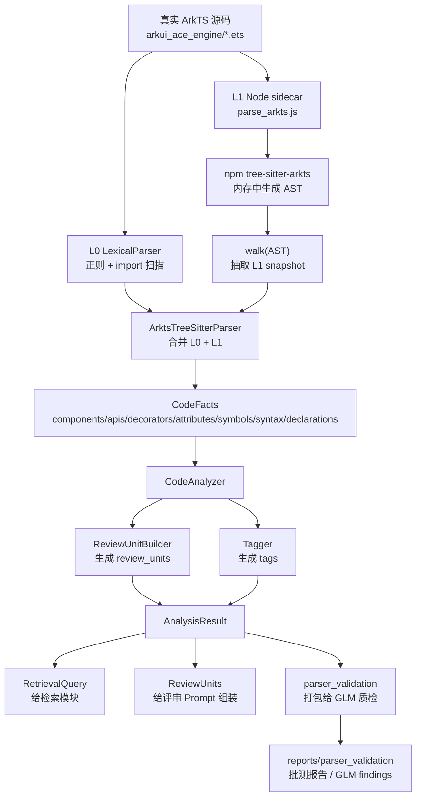

# 代码分析模块架构与数据流

> [!summary]
> 这份文档记录 `arkts-code-reviewer` 当前代码分析模块的真实实现状态。
> 它不是历史设计草案的简单搬运，而是把当前已经接入的 L0 / L1 / CodeAnalyzer / GLM parser-validation 链路重新整理成一张可维护地图。

## 1. 当前结论先行

当前代码分析模块已经达到：

```text
L0 词法层：已实现，作为兜底。
L1 结构层：已接入 tree-sitter-arkts sidecar，真实 ArkTS 样本批测可跑。
L2 结构组织层：已把 CodeFacts 转成 ReviewUnit / RetrievalQuery / tags。
L3 parser-validation 质检旁路：已接入 GLM，能发现 parser 疑点，但不直接进入生产评审链路。
```

当前字段语义约定：

```text
components:
  记录 ArkUI 组件，例如 Button / Column / Row / Image。

attributes:
  记录 ArkUI modifier / 属性，例如 onClick / animation / rotate / width / height。

apis:
  记录真正的系统/API 调用，例如 router.back / router.pushUrl / image.createPixelMap / setTimeout。
  不再记录 Button(...).onClick 这类 ArkUI 组件链。
```

最近一次关键验证：

```text
真实样本批测：
  样本来源：D:\Code\RAG-test\arkui_ace_engine
  样本清单：D:\Code\RAG-test\arkts-code-reviewer\tests\fixtures\arkui_ace_engine_samples.json
  样本数量：63
  parsed：63
  crashed：0
  empty_features：0
  parser_layers：{"L1": 63}

GLM 小批量质检：
  样本分类：animation_examples
  样本数量：3
  结果：2 pass，1 likely_parser_bug
```

GLM 已发现并已在 2026-07-07 修复的明确问题：

```text
1. attributes 漏提 rotate
2. apis 漏提 router.back
3. Button('change rotate angle') 被规范化成 Button('changerotateangle')
4. has_custom_component 标签可能误标
```

当前判断：

```text
开源 tree-sitter grammar 本身在 animation.ets 上没有解析失败。
问题主要出在我们自己从 AST 抽取 CodeFacts 的 L1 sidecar / adapter 逻辑，以及 tagger 规则。
当前已增加回归测试覆盖这些问题。
```

---

## 2. 目录与文件地图

### 2.1 主项目路径

```text
D:\Code\RAG-test\arkts-code-reviewer
```

### 2.2 真实 ArkTS 样本代码库

```text
D:\Code\RAG-test\arkui_ace_engine
```

这个目录不属于 `arkts-code-reviewer` 仓库本身。parser validation 通过样本清单里的相对路径指向这里。

### 2.3 样本清单

```text
D:\Code\RAG-test\arkts-code-reviewer\tests\fixtures\arkui_ace_engine_samples.json
```

它不是源码，只是“测试哪些文件”的名单。

示例：

```json
{
  "category": "animation_examples",
  "path": "examples/Animation/entry/src/main/ets/pages/animation.ets"
}
```

实际读取文件：

```text
D:\Code\RAG-test\arkui_ace_engine\examples\Animation\entry\src\main\ets\pages\animation.ets
```

公式：

```text
真实文件路径 = engine_root + sample.path
engine_root = D:\Code\RAG-test\arkui_ace_engine
```

---

## 3. 总体数据流



重要边界：

```text
生产分析链路：
  ArkTS 源码 -> CodeFacts -> AnalysisResult -> 检索 / Prompt 组装

质检旁路：
  ArkTS 源码 + AnalysisResult -> GLM Judge -> reports/parser_validation
```

GLM 质检结果只用于发现 parser 问题和沉淀 golden case，不直接进入生产评审结果。

---

## 4. 当前实现分层

为了避免和旧设计文档混淆，这里按“当前代码实际运行链路”划分。

| 层 | 名称 | 职责 | 主要文件 | 是否进入生产分析 |
|---|---|---|---|---|
| L0 | 词法兜底层 | 不依赖 AST，粗提取 imports / decorators / components / apis / declarations | `lexical.py` | 是 |
| L1 | 结构解析层 | 调 Node sidecar，用 tree-sitter-arkts 生成 AST，并抽结构事实 | `arkts_tree_sitter_parser.py`、`parse_arkts.js` | 是 |
| L2 | 结构组织层 | 把 CodeFacts 组织成 ReviewUnit、RetrievalQuery、tags | `analyzer.py`、`review_units.py`、`tagger.py` | 是 |
| L3 | parser 质检旁路 | 把源码和 parser 输出交给 GLM，找漏提/误提/边界问题 | `parser_validation/*`、`tools/validate_parser_with_llm.py` | 否，测试/质检用 |

> [!warning]
> 仓库旧文档 `docs/modules/code-analysis.md` 里曾描述过 SDK 白名单层、L2 语义层等设计目标。
> 当前代码里已经稳定运行的是上表这条工程链路。SDK 白名单和更完整的语义层仍属于后续增强方向。

---

## 5. L0 词法层

### 5.1 L0 是什么

L0 是最保守的 parser。它不用 tree-sitter，不需要 Node，不依赖开源 ArkTS grammar。

它的目标不是完美，而是：

```text
任何环境都能跑；
不会因为 L1 sidecar 缺失而中断；
作为 L1 的 fallback；
补一些 L1 可能漏掉的简单事实。
```

### 5.2 对应文件

```text
D:\Code\RAG-test\arkts-code-reviewer\src\arkts_code_reviewer\code_analysis\lexical.py
```

### 5.3 核心类与函数

```python
class LexicalParser:
    def parse(self, source: str, path: str) -> CodeFacts
```

关键函数：

| 函数 | 作用 |
|---|---|
| `_parse_imports()` | 提取 import 信息 |
| `_parse_components()` | 通过调用名和 ArkUI 组件白名单提取组件 |
| `_parse_apis()` | 根据 import alias 和调用表达式粗提取 API |
| `_parse_attributes()` | 提取链式属性，比如 `.onClick()`、`.width()` |
| `_parse_syntax()` | 提取 async / await / promise 等语法信号 |
| `_parse_declarations()` | 用正则和括号匹配提取 struct / class / method / build 等声明边界 |

### 5.4 L0 输出什么

L0 输出 `CodeFacts`，但 `parser_layer` 是：

```text
L0
```

示例事实域：

```text
imports
components
apis
decorators
attributes
symbols
syntax
declarations
warnings
```

### 5.5 L0 在 L1 中的作用

`ArktsTreeSitterParser` 开始时会先跑 L0：

```text
source -> LexicalParser.parse() -> L0 CodeFacts
```

之后如果 L1 成功，就把 L1 结果合并进 L0 结果。

如果 L1 失败，就保留 L0 结果，并把：

```text
parser_layer = "parse_degraded"
```

---

## 6. L1 结构层

### 6.1 L1 是什么

L1 用 tree-sitter 解析 ArkTS 源码，目标是比 L0 更准确地拿到：

```text
组件调用树
UI DSL 块边界
struct / class / method / build 边界
ArkUI 属性链
API 调用
语法节点
ERROR / missing 节点统计
```

### 6.2 接入的开源项目是哪一个

我们评审过两个开源 ArkTS tree-sitter 项目。最终选择的是 star 少一点的那个，也就是本地路径：

```text
D:\Code\RAG-test\tree-sitter\tree-sitter-arkts1
```

它已经被复制为源码快照：

```text
D:\Code\RAG-test\arkts-code-reviewer\third_party\tree-sitter-arkts
```

但当前运行时不是直接从 `third_party` 编译，而是通过 npm 依赖：

```text
D:\Code\RAG-test\arkts-code-reviewer\sidecars\arkts-parser\node_modules\tree-sitter-arkts
```

对应 package：

```text
tree-sitter-arkts@0.2.0
```

配置在：

```text
D:\Code\RAG-test\arkts-code-reviewer\sidecars\arkts-parser\package.json
```

### 6.3 为什么不是直接用 third_party

Windows 上直接编译 tree-sitter grammar 可能需要本地 C/C++ build toolchain。

当前选择：

```text
third_party/tree-sitter-arkts
  用作源码快照、审计、后续 patch 参考。

sidecars/arkts-parser/node_modules/tree-sitter-arkts
  当前实际运行用的 npm 包。
```

这样可以先保证 L1 能稳定跑通。

### 6.4 L1 的实际调用流程

入口：

```text
D:\Code\RAG-test\arkts-code-reviewer\src\arkts_code_reviewer\code_analysis\arkts_tree_sitter_parser.py
```

核心类：

```python
class ArktsTreeSitterParser:
    def parse(self, source: str, path: str) -> CodeFacts
```

流程：

```text
1. Python 先跑 L0 LexicalParser，得到 fallback facts。
2. Python 启动 node 进程。
3. node 执行 sidecars/arkts-parser/parse_arkts.js。
4. Python 通过 stdin 把源码传给 node。
5. parse_arkts.js 调用 npm 包 tree-sitter-arkts。
6. tree-sitter-arkts 在 Node 进程内存中生成 AST。
7. parse_arkts.js 递归遍历 AST，抽取 snapshot。
8. parse_arkts.js 把 snapshot 作为 JSON 打印到 stdout。
9. Python 读取 stdout，json.loads 成 dict。
10. Python 合并 L0 fallback facts + L1 snapshot。
11. 最终返回 CodeFacts(parser_layer="L1")。
```

对应代码片段：

```python
subprocess.run(
    [self.node_executable, str(self.sidecar_path), "--path", path],
    input=source.encode("utf-8"),
    capture_output=True,
)
```

### 6.5 AST 存在哪里

AST 不存文件。

它只存在 Node 进程内存里：

```js
const tree = parser.parse(source, null, { bufferSize });
walk(tree.rootNode, result, []);
```

最后落到 Python 的不是 AST，而是 sidecar 输出的 JSON snapshot。

### 6.6 AST 遍历由哪个文件负责

主要文件：

```text
D:\Code\RAG-test\arkts-code-reviewer\sidecars\arkts-parser\parse_arkts.js
```

关键函数：

| 函数 | 作用 |
|---|---|
| `main()` | 读取 stdin 源码，初始化 tree-sitter，生成 AST |
| `walk(node, result, stack)` | 递归遍历 AST 的主函数 |
| `declarationForNode(result, node, stack)` | 识别 struct / class / function / method / build / ui_block |
| `collectArkuiAttributes(result, node)` | 从 ArkUI component expression 提取属性 |
| `toOutput(result, path, rootType)` | 把遍历结果转成 JSON snapshot |

### 6.7 sidecar 输出的 snapshot

`parse_arkts.js` 输出 JSON，大致结构：

```json
{
  "parser": "tree-sitter-arkts",
  "parser_version": "0.2.0",
  "path": "examples/Animation/entry/src/main/ets/pages/animation.ets",
  "root_type": "program",
  "node_count": 654,
  "error_nodes": 0,
  "missing_nodes": 0,
  "components": ["Button", "Column", "Row"],
  "calls": ["Button('改变高度有动效').onClick", "back"],
  "decorators": ["@Component", "@Entry", "@State"],
  "attributes": ["animation", "backgroundColor", "height", "onClick", "width"],
  "symbols": ["AnimationExample", "AnimationExample.build"],
  "syntax": ["arrow_fn"],
  "declarations": []
}
```

这个 snapshot 不是最终结果。它还要交给 Python adapter 合并和规范化。

### 6.8 Python adapter 怎么合并

文件：

```text
D:\Code\RAG-test\arkts-code-reviewer\src\arkts_code_reviewer\code_analysis\arkts_tree_sitter_parser.py
```

关键函数：

| 函数 | 作用 |
|---|---|
| `parse()` | L1 入口，先跑 L0，再跑 sidecar，最后合并 |
| `_run_sidecar()` | 启动 node，拿 sidecar JSON |
| `_merge_snapshot()` | 把 sidecar snapshot 合并进 CodeFacts |
| `_parse_declarations()` | 把 sidecar declaration dict 转成 Python `Declaration` |
| `_canonicalize_calls()` | 规范化 calls，处理 import alias、过滤 `this.*` |
| `_alias_prefixes()` | 根据 import 信息建立 alias 到 canonical prefix 的映射 |

合并后输出：

```text
CodeFacts(parser_layer="L1")
```

---

## 7. CodeFacts 数据模型

定义文件：

```text
D:\Code\RAG-test\arkts-code-reviewer\src\arkts_code_reviewer\code_analysis\models.py
```

核心模型：

```python
@dataclass
class CodeFacts:
    path: str
    imports: list[ImportInfo]
    components: set[str]
    apis: set[str]
    decorators: set[str]
    attributes: set[str]
    symbols: set[str]
    syntax: set[str]
    declarations: list[Declaration]
    parser_layer: ParserLayer
    warnings: list[str]
```

各字段含义：

| 字段 | 含义 | 示例 |
|---|---|---|
| `imports` | import 信息 | `import router from '@ohos.router'` |
| `components` | ArkUI 组件名 | `Button`, `Column`, `Image` |
| `apis` | API 调用，尽量 canonical | `router.back`, `image.createPixelMap` |
| `decorators` | ArkTS 装饰器 | `@Entry`, `@Component`, `@State` |
| `attributes` | ArkUI 链式属性 | `onClick`, `width`, `animation`, `rotate` |
| `symbols` | 声明或符号名 | `AnimationExample`, `AnimationExample.build` |
| `syntax` | 语法特征 | `arrow_fn`, `async_fn`, `await_expr` |
| `declarations` | 结构边界 | `struct`, `build_method`, `ui_block` |
| `parser_layer` | 当前解析层 | `L0`, `L1`, `parse_degraded` |
| `warnings` | 降级或 AST 异常 | `arkts_tree_sitter_error_nodes: 3` |

---

## 8. L2 结构组织层

### 8.1 L2 是什么

这里的 L2 不是旧文档里的“LLM 语义层”，而是当前实现中的结构组织层。

它接收 `CodeFacts`，生成两类下游需要的东西：

```text
1. ReviewUnit
   给评审 Prompt 组装使用，里面是具体要评审的代码单元。

2. RetrievalQuery
   给检索模块使用，里面是 code_features、tags、triggered_dimensions。
```

### 8.2 核心入口

文件：

```text
D:\Code\RAG-test\arkts-code-reviewer\src\arkts_code_reviewer\code_analysis\analyzer.py
```

核心类：

```python
class CodeAnalyzer:
    def analyze_file(...)
    def analyze_files(...)
```

默认 parser：

```python
self.parser = parser or ArktsTreeSitterParser(fallback=LexicalParser())
```

也就是说默认会走 L1，L1 不可用时降级到 L0。

### 8.3 CodeAnalyzer 做什么

主流程：

```text
1. 对每个文件调用 parser.parse() 得到 CodeFacts。
2. 根据 mode 选择 full 或 diff。
3. 调 ReviewUnitBuilder 生成 review_units。
4. 对每个 review unit 再提取 unit_facts。
5. 调 derive_tags(unit_facts) 生成 tags。
6. 组装 RetrievalUnit。
7. 计算 MR 级 triggered_dimensions。
8. 返回 AnalysisResult。
```

### 8.4 ReviewUnitBuilder

文件：

```text
D:\Code\RAG-test\arkts-code-reviewer\src\arkts_code_reviewer\code_analysis\review_units.py
```

核心类：

```python
class ReviewUnitBuilder:
    def build_full_units(...)
    def build_diff_units(...)
```

职责：

```text
full 模式：
  通常按 declaration 生成 review unit。

diff 模式：
  根据 hunk 行号选择最合适的 declaration。
  如果找不到结构边界，退化为 hunk 附近窗口。
```

ReviewUnit 示例：

```text
unit_ref: AnimationExample@examples/Animation/.../animation.ets
unit_symbol: AnimationExample
full_text: struct AnimationExample { ... }
host_summary: decorators / states / lifecycle / imports
```

### 8.5 Tagger

文件：

```text
D:\Code\RAG-test\arkts-code-reviewer\src\arkts_code_reviewer\code_analysis\tagger.py
```

核心函数：

```python
derive_tags(facts: CodeFacts) -> set[str]
trigger_dimensions(tags: set[str]) -> list[str]
```

输入是 `CodeFacts`，输出 tags：

```text
has_layout
has_state_management
has_interactive_component
has_navigation
has_image
has_animation
```

历史问题：

```python
if facts.decorators & {"@Component", "@ComponentV2"}:
    tags.add("has_custom_component")
```

这个逻辑会导致任何定义了 `@Component struct` 的文件都被打上 `has_custom_component`。

对 `animation.ets` 来说，这可能是误标，因为 build 中只使用了内置组件 `Button / Column / Row`。

当前状态：

```text
2026-07-07 已移除这条规则。
has_custom_component 不再因为单纯定义 @Component 而触发。
后续如果需要区分“定义组件”和“使用自定义组件”，建议新增更明确的 facts/tags。
```

---

## 9. L3 parser-validation 质检旁路

### 9.1 这层是什么

parser-validation 不属于生产评审链路。

它的作用是：

```text
用真实 ArkTS 样本 + parser 输出，让 GLM 辅助判断：
  有没有漏提
  有没有误提
  canonicalization 是否异常
  ReviewUnit 边界是否合理
```

GLM 只是质检员，不是最终事实裁判。GLM findings 需要人工确认后，才能沉淀为 golden tests。

### 9.2 样本选择

样本清单：

```text
D:\Code\RAG-test\arkts-code-reviewer\tests\fixtures\arkui_ace_engine_samples.json
```

选择逻辑：

```text
load_manifest()
  -> 读取 samples.json

select_samples(category, sample_id, limit)
  -> 根据 category / sample_id / limit 过滤
```

对应文件：

```text
D:\Code\RAG-test\arkts-code-reviewer\src\arkts_code_reviewer\parser_validation\manifest.py
```

### 9.3 打包给 GLM

文件：

```text
D:\Code\RAG-test\arkts-code-reviewer\src\arkts_code_reviewer\parser_validation\packager.py
```

核心函数：

```python
build_validation_request(...)
```

它做的事情：

```text
1. 根据 engine_root + sample.path 读取真实 ArkTS 文件。
2. 调 parser.parse() 生成 CodeFacts。
3. 调 CodeAnalyzer.analyze_file() 生成 review_units / retrieval_units。
4. 截取源码片段 source_excerpt。
5. 打包成 ValidationRequest。
```

### 9.4 GLM Judge

文件：

```text
D:\Code\RAG-test\arkts-code-reviewer\src\arkts_code_reviewer\parser_validation\glm_judge.py
```

核心类：

```python
class GlmJudgeClient:
    def validate(self, request: ValidationRequest) -> JudgeResult
```

关键函数：

| 函数 | 作用 |
|---|---|
| `build_judge_messages()` | 构造 GLM prompt |
| `_post_chat_completion()` | HTTP 调用 GLM |
| `_extract_message_content()` | 从响应中取 `message.content` |
| `parse_judge_result()` | 把 GLM 输出解析成 JudgeResult |
| `_write_raw_response()` | 保存完整 GLM HTTP response |

### 9.5 GLM 输出文件

目录：

```text
D:\Code\RAG-test\arkts-code-reviewer\reports\parser_validation
```

重点文件：

| 文件 | 用途 |
|---|---|
| `batch_l1_latest.json` | L1 批测报告，不调用 GLM |
| `glm_findings_l1_glm51_smoke.jsonl` | 机器用，一行一个样本结果 |
| `glm_findings_l1_glm51_smoke.pretty.json` | 人看用，缩进格式 |
| `raw_glm/*.raw.json` | GLM 完整 HTTP 原始响应 |

---

## 10. 当前真实样本案例：animation.ets

### 10.1 文件位置

manifest 中相对路径：

```text
examples/Animation/entry/src/main/ets/pages/animation.ets
```

真实文件：

```text
D:\Code\RAG-test\arkui_ace_engine\examples\Animation\entry\src\main\ets\pages\animation.ets
```

文件规模：

```text
105 行
```

### 10.2 为什么选它

它不是 toy demo，但足够短，适合定位：

```text
有 @Entry / @Component
有 @State
有 Button / Column / Row
有 router.back()
有 animation()
有 rotate()
有链式 UI modifier
```

### 10.3 GLM 发现的问题

最新 GLM 结果：

```text
verdict: likely_parser_bug
findings: 6
```

人工核对后分级与当前修复状态：

| 问题 | 判断 | 责任文件 |
|---|---|---|
| `.rotate(...)` 没进 attributes | 已修复 | `parse_arkts.js` |
| `router.back()` 没进 apis | 已修复 | `arkts_tree_sitter_parser.py` |
| `Button('change rotate angle')` 变成 `Button('changerotateangle')` | 已修复 | `parse_arkts.js` |
| `Button("返回").onClick` 漏提 | 需要定义 apis/attributes 边界 | `parse_arkts.js` / parser policy |
| `Button().margin().height().animation()` 未作为完整 API 链 | 不一定是 bug，可能应归 attributes | parser policy |
| `has_custom_component` 误标 | 已修复当前误报 | `tagger.py` |

### 10.4 为什么不是开源 grammar 的锅

对 `animation.ets` 跑 sidecar 原始输出：

```text
error_nodes: 0
missing_nodes: 0
```

说明 tree-sitter grammar 成功解析。

当前问题主要是：

```text
AST 已经生成；
我们遍历 AST 和合并 facts 的规则不够准。
```

---

## 11. 批测和质检命令

### 11.1 L1 批测，不调用 GLM

```powershell
cd D:\Code\RAG-test\arkts-code-reviewer
python tools\run_arkts_parser_batch.py --parser arkts-tree-sitter --json-output reports\parser_validation\batch_l1_latest.json
```

看：

```text
reports\parser_validation\batch_l1_latest.json
```

关键指标：

```text
parsed
missing
crashed
empty_features
parser_layers
warning_counts
top_components
top_apis
top_tags
```

### 11.2 GLM 小批量质检

```powershell
cd D:\Code\RAG-test\arkts-code-reviewer
powershell -ExecutionPolicy Bypass -File tools\run_glm_l1_smoke.ps1 -ResponseFormat omit -MaxTokens 10000
```

默认参数：

```text
Category: animation_examples
Limit: 3
Model: glm-5.1
Thinking: enabled
ResponseFormat: omit
MaxTokens: 10000
```

看：

```text
reports\parser_validation\glm_findings_l1_glm51_smoke.pretty.json
```

### 11.3 跑 manifest 开头的前 3 个

```powershell
powershell -ExecutionPolicy Bypass -File tools\run_glm_l1_smoke.ps1 -Category "" -Limit 3 -ResponseFormat omit -MaxTokens 10000
```

### 11.4 跑指定样本

```powershell
powershell -ExecutionPolicy Bypass -File tools\run_glm_l1_smoke.ps1 -SampleId "examples/Animation/entry/src/main/ets/pages/animation.ets" -ResponseFormat omit -MaxTokens 10000
```

---

## 12. 结果文件怎么读

### 12.1 batch_l1_latest.json

这是稳定性报告。

它回答：

```text
parser 能不能跑？
有没有 crash？
有没有样本缺失？
有没有空特征？
是否都走到了 L1？
```

它不回答：

```text
抽取是否完全准确？
有没有漏提？
有没有误提？
```

### 12.2 glm_findings_l1_glm51_smoke.pretty.json

这是人工主要看的 GLM 质检报告。

核心字段：

| 字段 | 含义 |
|---|---|
| `sample_id` | 样本 ID |
| `source_path` | 相对于 `arkui_ace_engine` 的源码路径 |
| `verdict` | GLM 总体判断 |
| `independent_facts` | GLM 自己从源码中抽取的事实 |
| `findings` | GLM 认为 parser 可能有问题的点 |
| `review_unit_boundary` | GLM 对 ReviewUnit 边界的判断 |
| `raw_response` | GLM 原始 message.content 或 debug 摘要 |

`verdict` 判断：

| verdict | 含义 |
|---|---|
| `pass` | GLM 没发现明显问题 |
| `needs_human_review` | 有疑点，需要人工看 |
| `likely_parser_bug` | 高优先级疑似 parser bug |
| `invalid_output` | GLM 输出格式失败，不说明 parser 有问题 |
| `dry_run` | 没真实调用 GLM，只是打包 |

### 12.3 findings 怎么判断

重点看：

```text
kind
field
value
evidence_lines
confidence
retrieval_impact
reason
suggested_action
```

人工判断流程：

```text
1. 打开 source_path 对应的真实源码。
2. 跳到 evidence_lines。
3. 看源码里是否确实存在这个组件/API/属性/边界。
4. 打印或查看 parser 实际 CodeFacts。
5. 如果源码有、parser 没有，确认 missing。
6. 如果源码没有、parser 有，确认 false_positive。
7. 如果只是字段定义不同，比如 attributes vs apis，需要先确认 parser policy。
```

---

## 13. 当前修复记录与后续计划

> [!done]
> 2026-07-07 已完成本节 13.1 至 13.4 的首轮修复，并新增回归测试。
> 确定性批测结果：63 个真实样本全部 L1 解析成功，0 crash，0 empty_features。

### 13.1 P1：修 rotate 属性漏提

问题：

```text
源码有 .rotate({ angle: this.rotateAngle })
parser attributes 没有 rotate
```

计划：

```text
在 parse_arkts.js 中增强链式 modifier 识别。
当 call_expression 的 function 链以 .rotate / .animation / .width / .height / .margin / .onClick 等结尾时，把最后一个 property 加入 attributes。
```

当前状态：

```text
已修复。
新增 ARKUI_MODIFIERS 集合，并在 call_expression 遍历时识别最后一个链式 modifier。
```

### 13.2 P1：修 router.back 漏提

问题：

```text
L0 能提取 router.back
L1 合并后丢失
```

计划：

```text
在 arkts_tree_sitter_parser.py 的 _canonicalize_calls 合并 fallback_apis 时，保留 import alias 命中的 API。
```

注意：

```text
继续过滤 this.* / super.* / 普通局部对象方法，避免 API 污染。
```

当前状态：

```text
已修复。
L1 合并 fallback_apis 时会保留 import alias 命中的 API，例如 router.back。
```

### 13.3 P1：修字符串空格被吃掉

问题：

```text
Button('change rotate angle') -> Button('changerotateangle')
```

原因：

```js
fn.replace(/\s+/g, "")
```

计划：

```text
改成不破坏字符串字面量内部空格的 normalize。
短期可以先不做全局空白删除。
```

当前状态：

```text
已修复。
normalizeCallText 会删除字符串外部结构空白，但保留字符串字面量内部空白。
```

### 13.4 P2：修 has_custom_component 误标

问题：

```text
只要文件定义了 @Component，就被标 has_custom_component。
```

计划：

```text
has_custom_component 应表示 build 中使用了非内置自定义组件。
当前文件只使用 Button / Column / Row，不应标这个 tag。
```

可能方案：

```text
1. 从 facts.components 中区分内置组件和自定义组件。
2. 或新增 defines_component，避免 has_custom_component 语义混乱。
```

当前状态：

```text
已修复当前误报。
已移除“只要有 @Component 就打 has_custom_component”的规则。
后续如果需要准确识别自定义组件调用，再设计新的 facts/tags。
```

### 13.5 回归测试

围绕 `animation.ets` 或等价小片段增加测试：

```text
assert "rotate" in facts.attributes
assert "router.back" in facts.apis
assert no "changerotateangle" in facts.apis
assert "has_custom_component" not in tags for only built-in components
```

### 13.6 P1：收敛 apis 字段语义

问题：

```text
parser 曾把 ArkUI 组件链也放进 apis：
Button('change rotate angle').onClick(()=>{...}).margin(50).rotate(...).animation
```

这会导致：

```text
1. apis 字段混入 UI modifier 链，和系统 API 混杂。
2. 回调函数体被塞进 API 字符串，canonical name 过长。
3. GLM 质检会把 Button().animation / Button().onClick 当成 missing_api。
```

当前约定：

```text
apis:
  只保留真正 API 调用，比如 router.back / image.createPixelMap。

attributes:
  负责承载 UI modifier，比如 onClick / animation / rotate / margin。

components:
  负责承载 UI 组件，比如 Button / Column / Row。
```

当前状态：

```text
2026-07-07 已修复。
ArktsTreeSitterParser._canonicalize_calls 会过滤 ArkUI 内置组件链。
真实 animation.ets 当前输出：
  apis: router.back
  attributes: animation, backgroundColor, height, justifyContent, margin, onClick, rotate, width
```

---

## 14. 新人阅读顺序

如果之后要继续这个模块，推荐按这个顺序读：

```text
1. models.py
   先理解 CodeFacts / ReviewUnit / RetrievalQuery / AnalysisResult。

2. lexical.py
   理解 L0 兜底事实怎么来。

3. sidecars/arkts-parser/parse_arkts.js
   理解 AST 怎么被遍历，L1 snapshot 怎么来。

4. arkts_tree_sitter_parser.py
   理解 L0 + L1 怎么合并成 CodeFacts。

5. analyzer.py
   理解 CodeFacts 怎么变成 AnalysisResult。

6. review_units.py
   理解代码单元怎么切。

7. tagger.py
   理解 tags 和 triggered_dimensions 怎么来。

8. parser_validation/packager.py
   理解测试时怎么打包源码 + parser 输出。

9. parser_validation/glm_judge.py
   理解 GLM prompt 和 JSON 结果解析。
```

---

## 15. 一句话心智模型

```text
L0 负责兜底看见一些事实；
L1 负责借 tree-sitter 看见结构；
CodeAnalyzer 负责把事实组织成可评审、可检索的单元；
parser-validation 负责用 GLM 帮我们找 parser 的疑点；
reports 是测试质检产物，不是生产评审结果。
```
