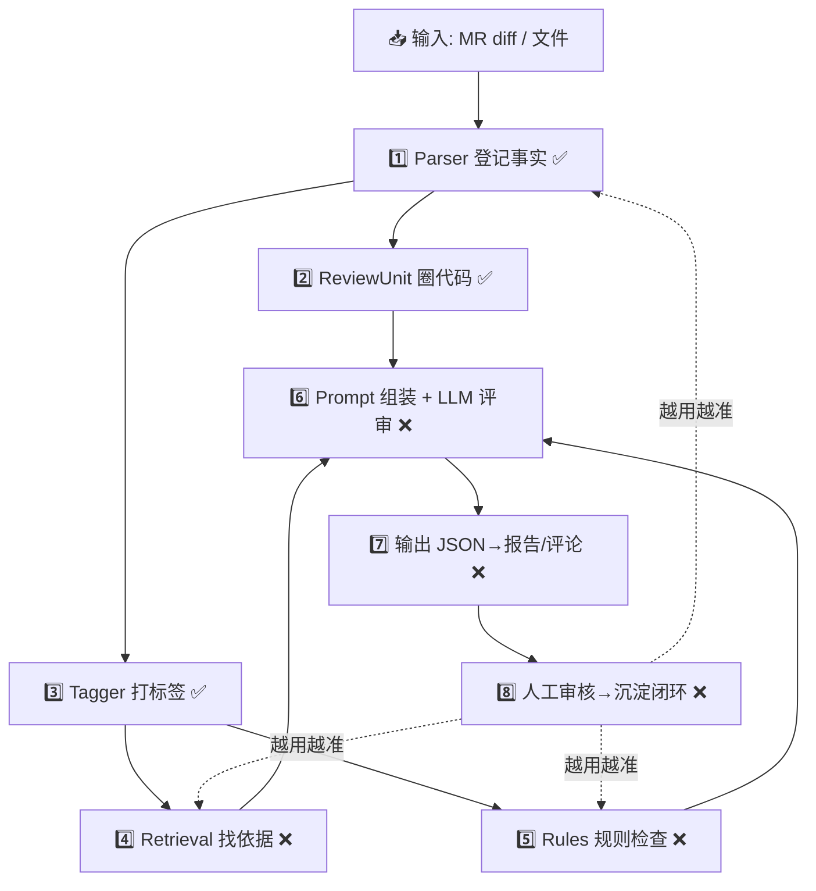
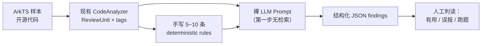

# 架构推进策略与 Mentor 对齐要点

> [!summary]
> 本文档基于对当前架构（`docs/architecture.md` + `docs/architecture-current.md`）和已实现代码的外部评审，记录两件事：
>
> 1. 架构评审结论与**调整后的推进思路**（架构不变，推进顺序调整）。
> 2. 按调整后思路重新组织的 **Mentor 会议对齐要点**，与 [[Mentor对齐问题清单-ReviewUnit与评审边界]] 互补使用。

## 通俗版完整架构（快速理解）

一句话：**做一个"AI 代码审查员"，同事提交 ArkTS 代码时自动看代码、挑毛病、给意见，
且每条意见都要有出处，不能瞎说。**

直接把代码丢给大模型评审有三个问题：

```text
1. 大模型不太懂 ArkTS（训练语料少），容易胡说。
2. 它爱编造规范（"华为文档说……"其实文档没说）。
3. 代码太长塞不下，不知道该看哪。
```

整个架构就是在大模型前面加一串"预处理流水线"，把活儿嚼碎了再喂给它。

### 流水线八步（以"MR 改了 Profile.ets 第 50~55 行"为例）

```text
1️⃣ Parser 登记事实（✅ 已实现）
   把代码变成结构化清单 CodeFacts：
   用了哪些组件/装饰器/API、每个 struct/方法的行号边界。
   双保险：L1 tree-sitter 精确解析为主，失败降级 L0 正则词法。
   类比：不做判断、只做登记的书记员。

2️⃣ ReviewUnit 圈代码（✅ 初版）
   只给 AI 看 6 行看不懂，看整个文件又跑题。
   根据声明边界智能圈出"刚刚好"的一块（如完整 build()），
   附一张"户口卡" host_summary（所属 struct、@State、生命周期、imports）。
   类比：医生圈出病灶区域 + 病人基本信息表。

3️⃣ Tagger 打标签（✅ 初版）
   有 setInterval → has_timer；有 Image → has_image。
   标签触发评审维度：has_timer → 重点查"定时器是否清理"。
   让 AI 带着检查清单看代码，而不是漫无目的。

4️⃣ Retrieval 找依据（❌ 设计中）
   拿标签和特征去知识库（官方文档/部门规范/Linter 规则）检索相关条款，
   打包成 Evidence Pack。AI 只能引用检索到的真实条款，条款 ID 机器可校验。
   类比：助理把法条查好放桌上，律师不许现场编法律。

5️⃣ Rules 确定性检查（❌ 设计中）
   代码出现 any → 100% 违规，规则直接报，零误报，不劳烦 AI。

6️⃣ Prompt 组装 + Final LLM 评审（❌ 设计中）
   把圈出的代码 + 改动行 + 户口卡 + 检查清单 + 证据包 + 规则结果
   打包发给大模型，要求输出严格 JSON（文件/行号/严重级/引用条款）。

7️⃣ 输出（❌ 设计中）
   JSON 是原始档案，渲染 Markdown 报告、回写 GitCode 行内评论。

8️⃣ 闭环（❌ 设计中）
   人工审核意见：对的沉淀 golden case 做回归，错的记 bad case 反哺。
   优秀写法经人审沉淀回知识库，系统越用越准。
```

### 全景图



### 架构思想

```text
不信任大模型的"自由发挥"——
看什么代码（ReviewUnit）、查什么问题（Tagger）、
依据什么规范（Retrieval）、哪些已经确认（Rules），
全部由确定性程序控制，大模型只做最后的"综合判断"，
且说话必须带出处。
```

现状：流水线前半段（1~3 步，"理解代码"）已实现；
后半段（4~8 步，"产生评审意见"）还是设计稿——
这正是 §2 推荐 tracer bullet 优先的原因。

## 1. 架构评审结论

### 1.1 总体判断

```text
分层架构本身是正确的，不需要结构性返工，值得继续推进。
```

做对了的关键决策：

```text
1. "确定性事实(parser+rules) + 检索依据 + LLM 判断" 的分层
   是压制 LLM 幻觉的正确路线。
2. 强制引用条款 ID 且机器可校验，是评审可信度的核心保障。
3. ReviewUnit 按声明边界切上下文（而非裸 hunk），
   是 diff 评审质量的核心正确决策。
4. GLM judge 只做质检旁路、不进生产链路，边界清晰。
5. JSON source of truth + Markdown 渲染，可追溯性好。
```

### 1.2 主要风险："头重脚轻"

当前投入几乎全部在 parser 侧精度打磨，但端到端价值**验证为零**：

```text
Retrieval / Rules / Final LLM Reviewer 均未落码。
系统的核心假设——"这套输入喂给 LLM 能产出有用的评审意见"——
至今没有被验证过。
```

风险后果：

```text
如果最终评审质量的瓶颈不在 parser 精度
（大概率在证据质量和 prompt 设计），
则当前在 parser 上的持续投入属于在错的地方优化。
```

## 2. 调整后的推进思路

### 2.1 核心调整：验证价值优先于打磨精度

原计划（Phase 1→5 线性推进）调整为：

```text
原顺序:
  ReviewUnit 稳定化 → Retrieval → Rules → Final LLM → 评测闭环

调整后:
  最简端到端链路（tracer bullet）先行，
  其余模块围绕端到端反馈迭代。
```

### 2.2 Tracer Bullet 最简链路



原则：

```text
1. 不做检索：先看 parser facts + rules + prompt 骨架能到什么水平，
   建立 baseline，再量化检索带来的增量。
2. 不做 GitCode 接入：CLI 离线跑通即可。
3. 不追求 prompt 完美：目的是暴露真实瓶颈，不是做产品。
4. 产出：10~20 个样本的评审结果 + 人工判读记录，
   作为后续所有模块投入优先级的依据。
```

### 2.3 Retrieval 降配起步

```text
第一版: 规则路由 + 关键词精确匹配（够用即可）。
向量检索 / pgvector / reranker: golden set 建立后，
用消融实验数据决定是否引入，不预先建设。

理由: 知识库条款百级规模时，规则+关键词大概率已覆盖主要场景；
向量检索的"符号 query vs 中文条款"语义鸿沟需要离线增强字段支撑，
而增强字段质量本身未验证，应先手工做 10 条验证再自动化。
```

### 2.4 必须尽早定死的工程约定：行号坐标系

当前存在三套行号（文件行号 / unit 内相对行号 / diff hunk 行号），
且 `analyzer.py` 对 unit 文本拼 imports 后二次 parse，行号与原文件脱钩。

约定建议：

```text
1. LLM 输入输出统一使用文件绝对行号。
2. ReviewUnit.full_text 喂给 LLM 时带行号前缀。
3. 回写 GitCode 行内评论的 file line → diff position 映射
   单独封装并写 deterministic tests。
```

### 2.5 二次 parse 的静默偏差（已知风险，记录在案）

```text
unit 文本单独 parse 会丢失 host struct 上下文
（如 method 中 this.timer 的资源属性），
导致 tag 漏触发 → 维度漏检 → 检索漏召回。

缓解方向: tags 以整文件 facts 为准，unit facts 只做特征收窄。
在 tracer bullet 阶段观察实际影响后再决定是否重构。
```

### 2.6 文档口径合并

```text
docs/architecture.md（早期草案，dimensions.yaml 配置驱动）
与 docs/architecture-current.md（当前快照，tagger 硬编码）
已开始漂移。建议 tracer bullet 跑完后统一口径，
避免设计文档与实现互相矛盾。
```

### 2.7 调整后的阶段划分

```text
Phase 0（新增，最优先）: Tracer Bullet 端到端验证
  现有 CodeAnalyzer + 手写规则 + 裸 LLM prompt + 人工判读。

Phase 1: ReviewUnit 稳定化（与 Phase 0 并行）
  deterministic tests、unit_kind / source_span / selection_reason、
  行号坐标系约定落地。

Phase 2: Rules 规则层
  第一批 10~20 条手写规则起步，rule registry 后置。

Phase 3: Retrieval（降配版）
  规则路由 + 关键词；golden set 建立后用数据决定向量检索取舍。

Phase 4: Final LLM Reviewer 正式化
  基于 Phase 0 的 prompt 骨架迭代，接入 evidence pack。

Phase 5: 评测闭环
  golden set、accepted/rejected 记录、误报率指标。
```

## 3. Mentor 会议对齐要点（按优先级重组）

> [!tip]
> [[Mentor对齐问题清单-ReviewUnit与评审边界]] 的 11 个问题已按决策性质
> 重新分组。**会议火力应集中在 ① ② ③ 组和新增问题**；
> ④ 组是工程实验参数，golden set 一跑就有答案，不必占用会议时间。

### ① 评审边界（阻塞一切设计，必须先定）

对应原清单问题一、三、四：

```text
1. 第一版主审 MR diff 还是整文件？
   推荐: MR diff 增量 + 手动单文件分析。

2. 旧代码问题（本次 diff 未改到）是否评论？
   推荐: 默认不报；仅当与本次改动有直接因果且能给出
   file/line/evidence 时才报。

3. ReviewUnit 上下文粒度策略是否接受？
   推荐: 完整 method / 完整短 build / 超长 build 取最近 ui_block /
   宁可上下文稍大不丢关键上下文。
```

### ② 验收标准（阻塞评测设计，必须先定）

对应原清单问题八：

```text
1. 第一版要低误报还是高覆盖？
   推荐: 低误报。评审 bot 被团队信任的机会只有一次，
   误报高会被立刻弃用。

2. 该结论直接决定: confidence 阈值、suggestion 是否放出、
   rules/LLM 配比、每 MR 评论数量上限。

3. 请 mentor 提供 5~10 个高质量/低质量 ArkTS review 示例
   作为判读基准。
```

### ③ 依据强度（阻塞 prompt 设计，必须先定）

对应原清单问题五、七：

```text
1. 哪些 severity 必须挂官方/内部规范条款？
   推荐: critical / high 必须挂条款；
   无依据意见降级为 suggestion 且限量（如每 MR ≤ 3 条）。

2. 是否允许 suggestion 类输出？

3. 无规范依据但 LLM 判断有风险的问题，报不报、用什么 severity？
```

### ④ 检索契约（实验参数，不必占用会议时间）

对应原清单问题十一及 architecture-current §8 的检索相关问题：

```text
Unit 级 vs MR 级检索、attributes / host_summary 是否进 query、
topK、token 预算、证据优先级排序——
均为 golden set 调参问题，先拍默认值（Unit 级 / 进 / topK=5），
数据说话，无需 mentor 拍板。
```

### ⑤ 新增对齐问题（本次评审补充）

原清单未覆盖、但影响近期 2~3 周工作排序的问题：

```text
1. 【演示场景】第一版给团队/领导 demo 的形式是什么？
   现场提 MR 看评论，还是拿历史 MR 离线回放报告？
   → 决定要不要先做 GitCode webhook 接入，还是 CLI 离线跑就够。

2. 【推进顺序确认】是否认可 "tracer bullet 端到端验证优先于
   parser/ReviewUnit 继续打磨" 的调整？
   → 决定下一步投入方向；若 mentor 坚持先磨 parser 精度，
   需要明确精度目标和验收方式。

3. 【LLM 资源】tracer bullet 需要可用的 LLM API
   （当前 GLM key 无额度）。用什么模型、额度谁批、
   开源样本是否可以直接发公有云 API？

4. 【golden set 排期】首批 30~50 条人工标注需要领域同事投入，
   是否可以开始排期？（原架构文档已列，需推动落地）
```

### 会议期望产出

```text
1. ① ② ③ 三组各拿到明确结论。
2. ⑤-2 推进顺序获得认可或明确替代方案。
3. ⑤-3 LLM 资源有落实路径。
4. 拿到 5~10 个 review 好坏示例（或约定提供时间）。
```

## 4. 相关文档

```text
docs/architecture.md                    早期总体设计草案
docs/architecture-current.md            当前真实架构快照
docs/code-analysis/Mentor对齐问题清单-ReviewUnit与评审边界.md
                                        产品层面 11 问完整版
docs/code-analysis/ReviewUnit模块完整设计.md
```
