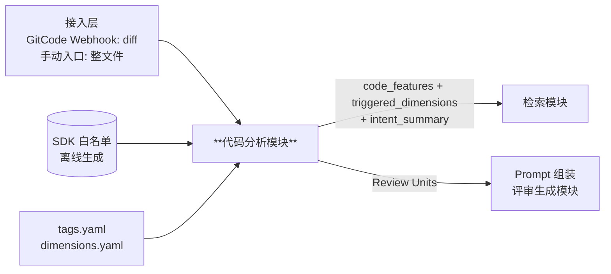
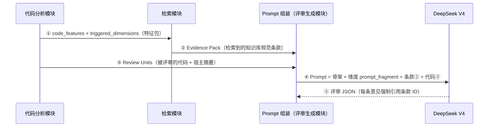

# 代码分析模块详细设计

- 所属系统: ArkTS 代码评审系统（arkts-code-reviewer）
- 文档状态: Draft（用于模块对齐评审）
- 最后更新: 2026-07-03
- 上游文档: [docs/architecture.md](../architecture.md)（§2 总体架构、§3.2 接入层、§3.3 评价维度）
- 下游契约: [docs/modules/retrieval.md](./retrieval.md) §1.3 —— 本模块输出即检索模块输入，
  该契约已定稿，本文档照契约履约
- 范围: 只覆盖代码分析模块。检索、评审生成（Prompt）等模块另行成文。

## 0. 贯穿全模块的设计原则

**事实不靠 LLM 记忆。** ArkTS 语料在大模型预训练中覆盖不足是本项目的既定约束，
且业界无成熟的开源 ArkTS 解析器。因此本模块的准确性策略是：

1. 一切客观事实（组件/API/装饰器/结构边界）来自**确定性解析 + 官方 SDK 权威数据**，
   可复现、可单测；
2. LLM 只做通用语义判断（读代码是分布内任务，不熟的是"写"和"背 API"——两者均不使用），
   且判断时注入已提取的确定性事实作为上下文；
3. 所有 LLM 产物带 provenance 标记，信任次序低于确定性产物
   （与检索模块 raw_keywords / llm_keywords 的信任次序同哲学）。

## 1. 模块定位与职责

### 1.1 在系统中的位置



端到端时序（评审一次 MR 的完整链路，注意两路输入在 Prompt 组装处**汇合**）：



避免误读的两点说明：

- **检索模块检索的是知识库条款，不是代码**。被评审的代码不经过检索模块——
  检索只消费特征标签（①），返回条款（②）；代码本体由本模块以 Review Unit
  形态直供 Prompt 组装（③）。③ 这条直连线是"运代码"，不是绕过检索。
- **评审这个核心动作 100% 由大模型完成**（⑤）。本模块的定位是给大模型备料：
  把事实、标签、扩展好上下文的代码准备到位，让 LLM 把 token 与注意力花在
  评审推理上，而非机械的标识符提取。

### 1.2 职责边界

**做什么**：

1. 在线：静态解析 .ets 源码，提取确定性事实（六个事实域，见 §2）
2. 在线：事实 → 特征标签（tags.yaml 规则求值）
3. 在线：维度触发求值（dimensions.yaml trigger 表达式）→ `triggered_dimensions`
4. 在线：diff 模式上下文扩展（改动 hunk → Review Unit 语义单元）
5. 在线：生成 `intent_summary`（代码意图摘要）
6. 离线：SDK 白名单生成管道（`tools/build_sdk_whitelist.py`）

**不做什么**：

- 不判断代码好坏（评审生成模块职责）
- 不检索知识库（检索模块职责）
- 不做完整类型检查/编译——本模块是**浅解析**定位：提标识符、定结构边界即可

### 1.3 输入 / 输出契约

输入（来自接入层，二选一）：

```jsonc
// diff 模式（GitCode Webhook）
{
  "mode": "diff",
  "mr": { "repo": "...", "iid": 42, "head_sha": "abc123" },
  "files": [ { "path": "src/pages/PhotoWall.ets", "hunks": [ { "new_start": 40, "new_lines": 18 } ] } ]
}
// 整文件模式（CLI / 网页）
{ "mode": "full", "files": [ { "path": "...", "content": "..." } ] }
```

输出一：检索模块输入（**照 retrieval.md §1.3 履约，字段不增不改**）：

```jsonc
{
  "code_features": {
    "components": ["Image", "Grid"],
    "decorators": ["@State"],
    "apis": ["setInterval", "image.createPixelMap"],
    "tags": ["has_image", "has_timer", "has_layout", "has_state_management"]
  },
  "triggered_dimensions": ["DIM-01", "DIM-06"],
  "intent_summary": "图片墙页面，含定时刷新与状态管理逻辑",
  "token_budget": 8000
}
```

输出二：Review Units（供评审 Prompt 组装，diff 模式核心产物，见 §6）。

输出三：分析元数据（落库，供追溯与质量观测）：`whitelist_version` /
`parser_layer`（L1 成功或 `parse_degraded`）/ tags 与 intent_summary 的 provenance。

## 2. 分层解析架构

**分层降级：下层永不失败，上层逐级增值。**

| 层 | 技术 | 职责 | 失败行为 |
|---|---|---|---|
| L0 词法层 | 正则 + import 扫描 | imports、`@装饰器`、标识符粗提取 | 保底层，不会失败 |
| L1 结构层 | tree-sitter-typescript（Python 绑定）+ 轻量预处理 | 组件调用树、函数/struct 边界、API 调用点、语法事实 | 降级 L0 + `parse_degraded` 标记，评审照常 |
| 白名单校准 | SDK 白名单（§3）查表 | 从 L0/L1 标识符中过滤真组件/真 API，附版本/废弃/系统接口元数据 | 纯查表，不失败 |
| L2 语义层 | LLM（经 LLM Gateway） | semantic 标签 + intent_summary（喂事实，不考记忆） | 降级为模板 summary + 跳过 semantic 标签 |

ArkTS 方言处理（L1）：

- `@State` 等装饰器是标准 TS 装饰器语法，直接可解析；
- UI DSL `Column() { ... }` 被解析为"调用表达式 + 独立块"，组件名照常提取；
- `struct X {` 预处理替换为 `class X {`（行列位置保持不变）后可完整解析；
- 解析产生的 ERROR 节点率作为健康指标持续观测（见 §8）。

**CodeParser 接口抽象**（复刻 Retriever 接口哲学）：

```python
class CodeParser(Protocol):
    def parse(self, source: str, path: str) -> CodeFacts: ...
```

- 当前实现：`TreeSitterParser`（L1）+ `LexicalParser`（L0 兜底）
- 升级路径：若实测精度不足，可实现 `OhosTscParser`
  （基于 OpenHarmony 官方维护的 ohos-typescript 编译器 fork，真正理解 ArkTS 语法），
  以 Node.js sidecar 形式接入。引入前需评审（给纯 Python 技术栈增加 Node 运行时）。

**事实六域**（`CodeFacts`，tags 规则的匹配对象）：

| 事实域 | 示例 | 来源 |
|---|---|---|
| `components` | Image, Grid | L1 调用树 + 白名单校准 |
| `apis` | setInterval, image.createPixelMap | L1 调用点 + 白名单校准（canonical 化） |
| `decorators` | @State, @Component | L0/L1 + 装饰器枚举表 |
| `attributes` | onClick, objectFit（链式属性调用） | L1 |
| `symbols` | aboutToDisappear（声明的方法名） | L1 |
| `syntax` | async_fn, await_expr, promise | L1 语法节点 |

## 3. SDK 白名单生成管道（离线）

### 3.1 数据源

OpenHarmony **`interface_sdk-js`** 仓库（开源，按 SDK 版本打 tag）。
关键优势：其中的 `.d.ts` 是**标准 TypeScript 声明文件，无 ArkTS 方言**，解析零障碍。

| 来源 | 提取物 |
|---|---|
| `api/@internal/component/ets/*.d.ts` | ArkUI 组件名 + 属性方法名（onError、objectFit 等） |
| `api/@ohos.*.d.ts` | 系统 API 模块名 + 函数/方法名 |
| 装饰器 | d.ts 中声明不规整，改用**人工枚举表**（官方文档为准，几十个，带分类元数据） |

JSDoc 标注同步提取，直接服务 API 兼容性维度：
`@since`（版本门槛）、`@deprecated` + `@useinstead`（废弃与替代建议）、
`@systemapi`（Inner 接口误用检测）、`@syscap`（系统能力依赖）。

### 3.2 产物 schema

```yaml
meta: { sdk_version: "API 12", source_commit: abc123, generator_version: v1 }
components:
  - name: Image
    since: 7
    attributes: [alt, objectFit, onError, onComplete]
apis:
  - module: "@ohos.multimedia.image"
    name: createPixelMap
    canonical: "image.createPixelMap"   # 模块限定名（代码侧按 import 解析）
    bare: "createPixelMap"              # 裸名（规范文本侧匹配用）
    since: 8
    deprecated: { since: 11, useinstead: "image.createPixelMapSync" }
    systemapi: false
decorators:
  - { name: "@State", category: state_management, since: 7 }
```

**命名规范化规则**：每个 API 双存 `canonical` + `bare`。代码侧提取按 import
解析为 canonical；规范文本常写裸名，按 bare + 别名表匹配。此规则写入产物 meta，
所有消费方共同遵守。

### 3.3 运行方式与版本策略

- 工具形态 `tools/build_sdk_whitelist.py`：输入 interface_sdk-js 的指定版本 tag，
  输出带版本号的白名单文件，**进 git**（SDK 升级 = 换 tag 重跑，产物 diff
  一目了然：新增/废弃了哪些 API）；
- 每份评审报告记录 `whitelist_version`（延续索引版本/配置版本的可追溯惯例）；
- **单版本设计 + 多版本扩展点**：产物自带 `sdk_version`，消费方参数化引用版本而非
  全局单例。未来多项目多 API 版本并存时 = 多份产物 + 项目配置选择，管道零改动。

### 3.4 白名单同源提案（⚠️ 待与检索模块确认）

retrieval.md §3.1 中条款解析器的 `raw_keywords` 提取依赖"ArkUI 组件/API 白名单
匹配"，但未定义白名单来源。**提案：两模块共用本管道的同一份产物**——

- 查询侧（本模块）与索引侧（检索条款解析器）使用同一词汇表与同一命名规范化规则，
  否则关键词召回会因词形不一致（如 `PixelMap` vs `image.createPixelMap`）失效；
- 管道归属本模块，检索模块以数据依赖方式消费（产物文件 + 版本号）。

## 4. 特征标签体系（tags.yaml）

### 4.1 定位

tags 回答"**这段代码里有什么**"（客观特征）；dimensions.yaml 回答
"**该用哪些角度去审**"（评审策略）；连接件是 dimensions 的 `trigger` 表达式
（以 tags 为词汇）。分两层的原因：规则复用（一个 tag 进多个 trigger）、
治理分离（SDK 变化改 tags.yaml，评审政策变化改 dimensions.yaml）。

**tags 的第一消费者是本模块内部的维度触发求值**；对检索模块只是按契约
附带传递的信号（检索域路由主要消费 components/apis 原始标识符）。

### 4.2 标签 schema（标签是数据，不是代码）

```yaml
# 确定性推导标签：事实集合 ∩ 规则集合非空 即命中（纯集合运算，引擎零业务逻辑）
- id: has_image
  source: derived
  rule:
    components: [Image, ImageSpan, ImageAnimator]
    apis: ['image.*']                  # 支持通配
# 语义标签：静态判不了，由 L2 LLM 判定
- id: has_user_visible_text
  source: semantic
  criteria: "代码中存在硬编码的用户可见字符串（界面文案），排除日志/异常消息"
```

- derived 规则可引用六个事实域（components/apis/decorators/attributes/symbols/syntax）；
- 输出的每个 tag 带 `source` provenance；**维度触发优先绑定 derived 标签**，
  semantic 标签只触发建议级检查，不支撑高严重级结论；
- CI 闭环校验：dimensions.yaml trigger 引用的 tag 必须在 tags.yaml 注册，
  检索路由表引用同理——防配置漂移。

### 4.3 初版标签清单（derived 24 + semantic 2）

条件维度触发标签：

| 维度 | 标签 | 规则要点 |
|---|---|---|
| 资源与内存 | has_image | components: Image/ImageSpan/ImageAnimator; apis: `image.*` |
| | has_timer | apis: setInterval/setTimeout/`systemTimer.*` |
| | has_subscription | apis: `*.on`/`*.off`/`*.once`/`emitter.*`/`sensor.*` |
| | has_media | apis: `media.*`/`audio.*`/`camera.*`; components: Video/XComponent |
| | has_file_io | apis: `fs.*`/`fileIo.*` |
| 并发与异步 | has_async | syntax: async_fn/await_expr/promise |
| | has_taskpool | apis: `taskpool.*` |
| | has_worker | apis: `worker.*`/ThreadWorker |
| 无障碍 | has_interactive_component | components: Button/Toggle/Slider/TextInput…; attributes: onClick/onTouch/gesture |
| 多设备适配 | has_layout | components: Row/Column/Flex/Grid/Stack/RelativeContainer… |
| | has_responsive_api | apis: `mediaquery.*`/`display.*`; components: GridRow/GridCol |
| 国际化 | has_text_display | components: Text/TextInput; attributes: placeholder |
| | has_user_visible_text（semantic） | 硬编码界面文案（排除日志） |
| | has_resource_ref | apis: `$r`/`$rawfile` |
| 安全 | has_permission_request | apis: requestPermissionsFromUser/`abilityAccessCtrl.*` |
| | has_user_input | components: TextInput/TextArea/Search |
| | has_network | apis: `http.*`/`socket.*`/`rcp.*` |
| | has_storage | apis: `preferences.*`/`relationalStore.*` |
| | handles_sensitive_data（semantic） | 账号/位置/通讯录等敏感数据操作 |
| API 兼容 / DFX | uses_deprecated_api / uses_system_api | 白名单交叉比对产出的信息标签（维度本身"总是"触发） |
| | has_logging | apis: `hilog.*` |

核心维度辅助标签（不做触发，供检索与 Prompt 聚焦）：
has_state_management（状态装饰器表）、has_lifecycle（symbols: aboutToAppear/
aboutToDisappear…）、has_list_render（List/Grid/WaterFlow + ForEach/LazyForEach/
Repeat）、has_animation（animateTo/transition）、has_custom_component
（@Component/@ComponentV2）、has_builder（@Builder/@BuilderParam）、
has_navigation（Navigation/`router.*`）。

已知取舍：`has_subscription` 的 `*.on` 通配最易误报（业务对象也可能有 on 方法），
初版接受——维度触发宁多勿漏，误触发代价只是多查一个维度。

## 5. 维度触发计算

- 表达式语法：`AND / OR / NOT + 括号`，仅此而已。不做数值比较、不做函数调用——
  表达式简单是治理红线（dimensions.yaml 面向人工评审）；
- 求值引擎：tags 集合上的布尔求值，纯函数、可单测；
- 核心 5 维无 `trigger` 字段 = 无条件触发；
- `status: Draft` 的维度照常求值，结果标 shadow（影子灰度，架构 §3.3 已定）；
- diff 模式的求值范围见 §6 双档提取。

## 6. diff 模式上下文扩展

**问题**：webhook 送达的是 hunk 片段，直接评片段会误判（架构 §3.2 预警）。
本模块将 hunk 还原为可评审的语义单元。

### 6.1 流程与扩展规则

1. **取全文**：从 GitCode API 拉 MR head commit 的完整新版文件（diff 文本不够），
   L1 解析全文得到结构边界；
2. **hunk 行区间 → AST 声明边界，三级扩展**：
   - 一级：hunk 所在最小具名声明（方法/函数/@Builder 函数）→ 取完整文本；
   - 二级（build 特例）：hunk 落在 `build()` UI DSL 且 build 超长时，取包含 hunk 的
     最近顶层组件子树（如 Column/List 一支），不整个 build 全吞；
   - 三级兜底：L1 解析降级时退化为 hunk ± N 行滑窗 + `context_degraded` 标记；
3. **宿主摘要**：每个单元附宿主 struct 的**结构化事实摘要**（非原文，省 token）：
   struct 名 + 装饰器、全部状态变量声明（@State/@Link 及类型）、生命周期方法列表、
   imports。均为 L1 已提取事实，零额外成本。

### 6.2 产物：Review Unit

```jsonc
{
  "file": "src/pages/PhotoWall.ets",
  "unit_symbol": "PhotoWall.loadImages",
  "full_text": "…扩展后的完整函数文本…",
  "changed_lines": [45, 52],          // 单元内改动行，评审意见须锚定于此
  "host_summary": {
    "struct": "PhotoWall", "decorators": ["@Component"],
    "states": ["@State photos: PixelMap[]"], "lifecycle": ["aboutToDisappear"]
  }
}
```

一个 MR = 每文件若干 Review Unit；检索 query 与评审 Prompt 均以 Unit 为消费单位。
边界情况：新增文件走整文件模式；纯删除 hunk 锚定新版相邻代码；重命名按新路径处理。

### 6.3 双档特征提取

- **主档**：tags / 维度触发 / 检索 query 由 **Review Units 范围**的事实驱动——
  评审聚焦改动，不因文件中未被改动的旧代码触发无关维度（MR 评审大忌：意见跑到
  没改的代码上）；
- **辅档**：文件全量事实只进宿主摘要作背景，不驱动触发。

## 7. intent_summary 生成

- **主路（搭 L2 顺风车）**：L2 判 semantic 标签的同一次 LLM 调用顺带产出
  intent_summary（输入：Review Units + 宿主摘要 + 文件路径线索；输出 schema
  增加一个字段），零额外调用；
- **兜底（模板）**：L2 未启用/失败时，从 facts 确定性拼装——
  "使用 Image、Grid 组件的页面，含定时器与状态管理逻辑"。可复现，质量够向量检索用；
- 约束：1~2 句中文，必须提及场景与核心组件；输出带 provenance（`llm` / `template`）。

**分阶段交付含义**：semantic 标签仅 2 个且有 derived 近似兜底（has_text_display /
has_user_input+has_network），intent_summary 有模板兜底——**L2 语义层整体可延后
交付**，L0+L1+白名单即可跑通全链路。

## 8. 质量保障

准确性四支柱（对应 §0 原则）：

| 支柱 | 机制 |
|---|---|
| SDK 白名单 | 组件/API 全集自动生成自官方声明文件，权威、随版本更新、零幻觉 |
| 装饰器枚举表 | 有限官方集合，查表分类，准确率≈100% |
| 解析器 golden set | OpenHarmony `applications_app_samples`（数千真实 .ets）+ 部门代码抽样，人工标注"文件 → 应提取特征"，量化 precision/recall；tree-sitter 容忍度**不靠猜，靠测** |
| LLM 喂事实 | L2 Prompt 注入确定性事实 + 定义，只做通用语义判断 |

可观测指标（持续跟踪）：L1 ERROR 节点率、`parse_degraded` 率、特征提取
precision/recall（golden set 回归）、semantic 标签与人工抽检的一致率。

## 9. 与检索模块的对齐状态

| # | 事项 | 状态 |
|---|---|---|
| 1 | 输出契约（code_features/tags/triggered_dimensions/intent_summary） | ✅ 照 retrieval.md §1.3 履约，字段不增不改 |
| 2 | 白名单同源（§3.4） | ⚠️ **提案，待检索模块确认**：条款解析器 raw_keywords 与本模块共用同一产物与命名规则 |
| 3 | triggered_dimensions 计算归属本模块 | ✅ 契约已明示，登记备查 |
| 4 | tags.yaml 加入配置治理家族（与 dimensions.yaml / 路由表同套），CI 交叉校验 | ✅ 本模块单方面实现 |

## 10. 决策状态

已定（模块对齐基线）：

- [x] LLM 边界 = 方案 B：解析器确定性提标识符，LLM 只做 semantic 标签 + intent_summary
- [x] 分层降级解析：L0 词法保底 → L1 tree-sitter（struct→class 预处理）→ 白名单校准 → L2 语义层
- [x] CodeParser 接口抽象；ohos-typescript sidecar 为升级路径（引入需评审）
- [x] 事实六域：components / apis / decorators / attributes / symbols / syntax
- [x] SDK 白名单管道：interface_sdk-js + JSDoc 元数据；canonical/bare 双命名；单版本 + 多版本扩展点；产物进 git
- [x] tags.yaml 双来源（derived/semantic）+ provenance 分级信任 + CI 闭环校验；初版清单 derived 24 + semantic 2
- [x] 维度触发：AND/OR/NOT 布尔表达式，纯函数求值，Draft 维度 shadow
- [x] diff 上下文：三级扩展 + 宿主摘要 + Review Unit 产物 + 双档特征提取
- [x] intent_summary：L2 顺风车 + 模板兜底，带 provenance
- [x] L2 语义层可延后交付，L0+L1+白名单先跑通全链路

待定（实现/调优阶段决定）：

| 待定项 | 决策方式 |
|---|---|
| tree-sitter 对真实 .ets 的解析精度 | 解析器 golden set 实测（测试结果回流迭代） |
| 白名单同源提案 | 与检索模块对齐确认 |
| Review Unit 的 token 上限与 build 子树切分粒度 | 对真实 MR 调参 |
| 模板 intent_summary 对向量召回的质量是否够用 | golden set 消融对比（模板 vs LLM 版） |
| L2 语义层 Prompt 与输出 schema | 与评审 Prompt 专项设计一并进行 |
| `*.on` 通配误报率与规则收紧 | 上线后按误触发数据迭代 |
| 装饰器枚举表初版（V1/V2 状态管理全集） | 对官方文档整理，随 SDK 版本维护 |

## 11. 技术栈

沿用 retrieval.md §9 全套（Python 3.12（`>=3.12,<3.13`）/ uv / Pydantic v2 /
pytest / ruff + mypy）。本模块新增依赖：

| 依赖 | 用途 | 说明 |
|---|---|---|
| tree-sitter + tree-sitter-typescript（Python 绑定） | L1 结构层解析 | 容错解析，纯 Python 生态内 |

不引入 Node.js 运行时（ohos-typescript 升级路径触发时再专项评审）。
