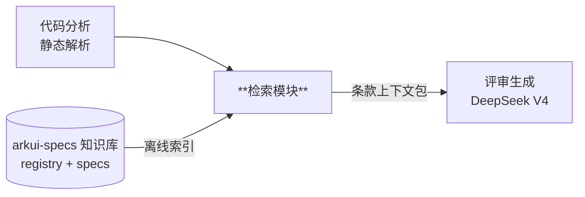
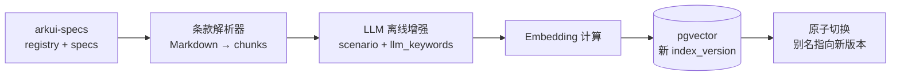
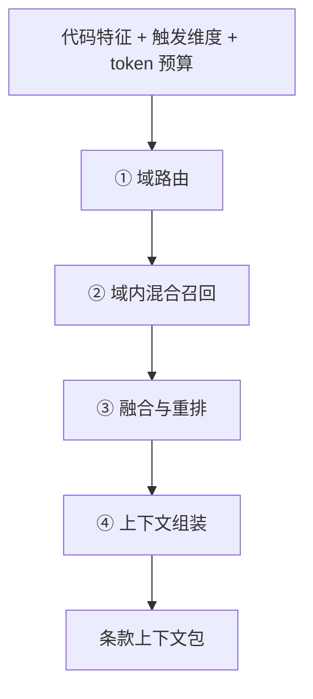

# 检索模块详细设计

- 所属系统: ArkTS 代码评审系统（arkts-code-reviewer）
- 文档状态: Draft（用于模块对齐评审）
- 最后更新: 2026-07-03
- 上游文档: [docs/architecture.md](../architecture.md) 第 3.4 节
- 范围: 只覆盖检索模块。评审生成（Prompt）、知识沉淀回流等模块另行成文。

## 1. 模块定位与职责

### 1.1 在系统中的位置



### 1.2 职责边界

**做什么**：

1. 离线：将知识库的 spec 条款解析、增强、构建为可检索索引
2. 在线：接收代码静态分析结果，返回与该代码最相关的知识库条款集合
   （带 ID、可溯源、按 token 预算裁剪）

**不做什么**：

- 不调用大模型做评审（那是评审生成模块的职责；本模块仅在离线增强时用一次 LLM）
- 不解析代码（静态解析属于代码分析模块，本模块消费其产出的特征标签）
- 不判断代码好坏

### 1.3 输入 / 输出契约

输入（来自代码分析模块）：

```jsonc
{
  "code_features": {
    "components": ["Image", "List"],        // 使用的 UI 组件
    "decorators": ["@State", "@Link"],      // 装饰器
    "apis": ["getContext", "animateTo"],    // API 调用
    "tags": ["has_image", "has_async"]      // 特征标签（与维度触发器共用）
  },
  "triggered_dimensions": ["DIM-01", "DIM-06"],  // 已触发的评价维度
  "intent_summary": "图片列表懒加载页面",          // 可选：代码意图摘要
  "token_budget": 8000                            // 条款上下文总预算
}
```

输出——Evidence Pack（供 Prompt 组装器消费，同时满足可调试性）：

```jsonc
{
  "index_version": "idx-2026-07-03-001",
  "clauses": [
    {
      "rule_id": "04-01-01/Feat-01/R-17",     // 全局唯一条款 ID
      "func_id": "04-01-01",
      "feat_id": "Feat-01",
      "rule_type": "RULE",
      "status": "Baselined",
      "dimension": "DIM-06",                  // 归属的评价维度
      "text": "……条款原文……",
      "heading_path": "Feat-01 图片加载机制 > 功能规则 > 缓存策略",  // 上下文定位
      "neighbor_rule_ids": ["…/R-16", "…/R-18"],   // 相邻条款指针，组装时按需取
      "source_path": "04-common-capability/01-image-loading/.../Feat-01-...-spec.md",
      "source_anchor": "L142-L150",           // 源文件行锚点，误召回排查用
      "score": 0.87,
      "matched_by": ["keyword:Image", "keyword:onError", "vector"],  // 命中途径
      "match_reason": "命中 Image 组件 + onError API，归属 DIM-06 资源维度",
      "rank_detail": {                        // 排序过程快照
        "keyword_rank": 2, "vector_rank": 5,
        "rrf_score": 0.031, "status_boost": 1.2
      }
    }
  ]
}
```

`matched_by` / `match_reason` / `rank_detail` / `source_anchor` 是**调试字段**：
不进评审 Prompt（不占 token），但全量落库到评审记录，供误召回排查与
bad case 分析使用。

## 2. 数据模型

### 2.1 条款 Chunk 结构

切块原则：**条款级 chunk 是检索主单元**（每条编号条款一个 chunk），但 chunk
不是孤立文本——必须携带上下文定位字段，供组装阶段还原条款的适用背景
（原则：**检索单元 ≠ 生成单元**）。design.md 按 ADR 条目与小节切块；
无编号条款的段落退化为 PARAGRAPH 级 chunk。

`rule_type` 取值必须覆盖知识库**真实**条款体系（对现有 28 份 spec 的全量扫描
结果：AC 3016 条、R 1824 条、US 213 条、VM 188 条、ADR 77 条、BR 13 条、
ER 3 条、FR 2 条、RC 1 条；且存在 `AC-1.1` 式带小数点的层级编号）：

```text
rule_type ∈ { RULE(R), AC, US, BR, FR, ER, RC, VM, ADR, SECTION, PARAGRAPH }
rule 编号支持层级小数点：R-17、AC-9.2、VM-1 均为合法
```

| 字段 | 说明 | 来源 |
|---|---|---|
| `rule_id` | 全局唯一 ID：`{func_id}/{feat_id}/{type}-{n[.m]}` | 解析器生成 |
| `func_id` | L1-L2-L3 功能域 ID | registry/functions.yaml |
| `feat_id` | 特性 ID | registry/features.yaml |
| `rule_type` | 见上述取值集合 | 解析器 |
| `status` | Baselined / Draft / Deprecated | features.yaml 继承 |
| `text` | 条款原文 | spec 文档 |
| `heading_path` | 标题链（文档 > 章 > 节），定位适用背景 | 解析器 |
| `parent_section` | 所属小节的引言/背景文本摘要 | 解析器 |
| `neighbor_rule_ids` | 前后相邻条款 ID 指针（组装时按需取原文，不冗余存储） | 解析器 |
| `scenario` | 适用场景描述（离线增强生成） | LLM 增强 |
| `raw_keywords` | 确定性提取的关键词：正则/代码块解析/API 白名单 | 解析器 |
| `llm_keywords` | LLM 增强补充的关键词 | LLM 增强 |
| `enhancer_version` | 增强器版本（升级后据此判断哪些条款需重新增强） | 增强管道 |
| `embedding` | scenario + text 的向量 | Embedding 模型 |
| `source_path` | 源文件路径 | 解析器 |
| `source_anchor` | 源文件行号范围（如 `L142-L150`） | 解析器 |
| `doc_hash` | 源文档内容哈希（增量更新判据） | 解析器 |

关键词双来源的信任次序：**检索打分时 `raw_keywords`（确定性）权重高于
`llm_keywords`（可能漏/猜/幻觉）**。不采用 LLM 自报置信度分数（校准性差），
以关键词的 provenance（来源标记）加权代替。

### 2.2 存储 Schema（pgvector）

```sql
CREATE EXTENSION IF NOT EXISTS vector;
CREATE EXTENSION IF NOT EXISTS pg_trgm;

CREATE TABLE kb_clauses (
    rule_id      TEXT PRIMARY KEY,
    func_id      TEXT NOT NULL,
    feat_id      TEXT NOT NULL,
    rule_type    TEXT NOT NULL,
    status       TEXT NOT NULL,
    text         TEXT NOT NULL,
    heading_path TEXT,
    parent_section TEXT,
    neighbor_rule_ids TEXT[],
    scenario     TEXT,
    raw_keywords TEXT[],               -- 确定性提取，打分权重高
    llm_keywords TEXT[],               -- LLM 增强补充
    enhancer_version TEXT,
    embedding    vector(1024),          -- 维度随 embedding 模型定
    source_path  TEXT NOT NULL,
    source_anchor TEXT,
    doc_hash     TEXT NOT NULL,
    index_version TEXT NOT NULL
);

CREATE INDEX ON kb_clauses USING gin (raw_keywords);
CREATE INDEX ON kb_clauses USING gin (llm_keywords);
CREATE INDEX ON kb_clauses USING gin (text gin_trgm_ops);   -- 模糊兜底
CREATE INDEX ON kb_clauses USING hnsw (embedding vector_cosine_ops);
CREATE INDEX ON kb_clauses (func_id, status);
```

中文分词规避策略：关键词匹配走 `raw_keywords` / `llm_keywords` 字段（以英文
标识符为主：组件名/API 名/装饰器名），配合 pg_trgm 模糊兜底，**不依赖**
zhparser / pg_jieba 等中文分词扩展。

## 3. 离线索引管道



### 3.1 条款解析器

- 输入：`registry/functions.yaml`、`registry/features.yaml`、各 `Feat-*.md` / `design.md`
- 按 spec 文档的结构化编号条款（R/AC/US/VM/ADR 等，见 §2.1 真实分布）切块，
  支持 `AC-1.1` 式层级编号；历史文档格式不完全
  统一，解析器需容错并输出"未能解析的文档"清单供人工处理
- 解析同时产出上下文字段（heading_path / parent_section / neighbor_rule_ids /
  source_anchor）与 `raw_keywords`（正则提取代码块与反引号标识符 + ArkUI
  组件/API 白名单匹配）
- `status` 从 features.yaml 继承到条款级

### 3.2 LLM 离线增强（解决词汇鸿沟）

- 问题：条款是中文规范语言，查询是代码特征（英文标识符），直接匹配召回率低
- 方案：离线为每条款生成
  1. `scenario`：一段"什么代码场景适用本条款"的自然语言描述
  2. `llm_keywords`：本条款涉及的组件 / API / 装饰器标识符列表（作为
     `raw_keywords` 的补充，非唯一来源）
- 增强产出带 `enhancer_version`；增强器升级后按版本号识别需重跑的条款
- 每条款只在首次入库或源文档变更时增强一次，在线零成本
- 增强 Prompt 与产出 schema 待与沉淀模块 Prompt 一并设计（见待定项）

### 3.3 增量更新与原子切换

- **增量**：按 `doc_hash` 比对，只重建变更文档的 chunks（知识沉淀回流会持续
  产生新 spec，全量重建不可持续）
- **原子**：新批次写入带新 `index_version`，全部完成后切换"当前版本"别名；
  在线检索永不读到半成品
- **可追溯**：每份评审报告记录所用 `index_version`
- **触发**：挂 CI —— 知识库 registry 或 spec 变更即触发增量构建
  （工具形态：`tools/build_search_index.py`）

## 4. 在线检索流程



### ① 域路由（coarse）

- **规则优先**：特征 → FuncID 映射表（如 `Image` → `04-01` / `05-08`），
  registry 三级功能域即路由表。规则可解释、可人工修正，准确率优先于纯语义
- **语义兜底**：规则未命中时，用 `intent_summary` 的 embedding 与功能域
  description 做相似度分类
- 输出：候选功能域集合（top 3~5），作为下一步的元数据过滤条件
- 路由映射表配置化（YAML），与 dimensions.yaml 同套治理

### ② 域内混合召回

两路并行，均限定在候选功能域内且 `status != 'Deprecated'`：

| 召回路 | 匹配对象 | 说明 |
|---|---|---|
| 关键词路 | `raw_keywords`（权重高）+ `llm_keywords`（补充）精确/前缀匹配 + pg_trgm 兜底 | API/组件名命中权重高 |
| 向量路 | `embedding` 余弦相似度（HNSW） | query = intent_summary 或特征拼接文本 |

### ③ 融合与重排

- 两路结果 **RRF**（Reciprocal Rank Fusion）融合
- 可选 **reranker**（cross-encoder）精排 —— 是否引入待消融实验（小规模下
  收益可能有限，见待定项）
- 状态加权：`Baselined` 优先，`Draft` 降权

### ④ 上下文组装

- 按触发维度分配 token 配额，保证每个命中维度至少有条款（避免单一维度
  垄断预算）
- **上下文还原**：为命中条款附加 `heading_path`；条款孤立不可读时按
  `neighbor_rule_ids` / `parent_section` 取父节背景一并注入（占对应维度配额）
- 同一 Feat 相邻条款去重合并
- 每条带 `rule_id`，供评审 Prompt 强制引用与机器校验

### 缓存

`(文件内容 hash, index_version)` → 检索结果缓存。时延大头是 LLM 调用（秒级），
检索本身不是瓶颈，不做过度优化。

## 5. Retriever 接口抽象

```python
class Retriever(Protocol):
    def index(self, chunks: list[Clause], index_version: str) -> None: ...
    def search(self, query: Query, filters: Filters, top_k: int) -> list[ScoredClause]: ...
    def delete(self, rule_ids: list[str]) -> None: ...
    def switch_version(self, index_version: str) -> None: ...
```

- 上层（路由、融合、组装）只依赖此接口，不感知后端实现
- 当前唯一实现：`PgVectorRetriever`
- **契约测试**：一套针对接口语义的测试集，任何后端实现必须全部通过；
  未来若需更换后端（如 Milvus），新实现过契约测试后以**影子对比**方式切换
  （新旧并行、比对 recall 一致性），不做硬切
- 明确否决的方案：按数据量阈值在 SQLite+Faiss / pgvector 间运行时切换的
  双栈方案 —— 双实现、双测试矩阵、高风险迁移点，成本高于收益

## 6. 质量度量与回归

| 机制 | 内容 |
|---|---|
| golden set | 人工标注 30~50 组「代码样例 → 应命中条款」，CI 跑 recall@K 回归；**一切检索调优以此为依据** |
| 同步增长 | 知识沉淀回流的新条款，要求作者附 1 个"应命中案例"进 golden set |
| bad case 回流 | 评审被人工纠错时记录，反哺路由映射表与增强字段 |
| 契约测试 | 保证后端实现符合接口语义 |

## 7. 性能与容量预估

| 规模 | 存储 | 查询时延 | 结论 |
|---|---|---|---|
| 当前（数百条款） | 向量数据 < 5MB | < 10ms | 单 Postgres 容器（2GB 内存）绰绰有余 |
| 1 万条款 | ~40MB（1024 维 × 4B） | < 50ms | HNSW 索引构建秒级，无需调参 |
| 百万条款 | ~4GB | < 100ms | 调 HNSW 参数即可，仍单实例 |

## 8. 决策状态

已定（架构决策，模块对齐的基线）：

- [x] 条款级切块为检索主单元 + 上下文字段（heading_path / parent_section / neighbor_rule_ids）
- [x] rule_type 覆盖真实条款体系（R/AC/US/BR/FR/ER/RC/VM/ADR/SECTION/PARAGRAPH，支持层级编号）
- [x] 关键词双来源：raw_keywords（确定性，权重高）+ llm_keywords（LLM 增强补充）+ enhancer_version
- [x] LLM 离线增强（scenario + llm_keywords）解决词汇鸿沟
- [x] 规则域路由优先、语义分类兜底，路由表配置化
- [x] 关键词 + 向量双路召回 → RRF 融合，状态加权
- [x] Retriever 接口抽象 + pgvector 单后端 + 契约测试
- [x] 增量索引 + 原子版本切换 + 报告记录索引版本
- [x] golden set 回归机制与同步增长规则
- [x] 中文分词规避：raw/llm keywords 字段 + pg_trgm，不引入中文分词扩展
- [x] Evidence Pack 携带调试字段（matched_by / match_reason / rank_detail / source_anchor），不进 Prompt、全量落库

待定（实现/调优阶段决定）：

| 待定项 | 决策方式 |
|---|---|
| Embedding 模型选型（候选 bge-m3，需确认内网可部署性） | golden set 对比 2~3 个模型 |
| Reranker 取舍与选型 | 消融实验（有无 rerank 的 recall 对比） |
| top-K、token 预算默认值、维度配额策略 | golden set 调参 |
| 条款解析器对历史非统一格式文档的容错细则 | 对真实文档迭代 |
| 离线增强 Prompt 与产出字段 schema | 与沉淀模块 Prompt 一并设计 |
| 路由映射表初版规则集 | 领域专家 + 对知识库现有 28 份 spec 归纳 |
| golden set 首批标注 | 需领域同事投入，建议尽早排期 |

## 9. 技术栈

模块形态：**纯 Python 库**（`src/` 布局 package），不含服务框架；
将来由接入层服务 import。服务框架（如 FastAPI）由接入层模块另行决策。

| 层 | 选型 | 理由 |
|---|---|---|
| 语言 | Python 3.12 | RAG / embedding 生态完整，且 sentence-transformers / PyTorch 等依赖兼容性更稳；后续 `pyproject.toml` 建议约束为 `>=3.12,<3.13` |
| 包管理 | uv + `pyproject.toml` | 快、锁定依赖、事实标准 |
| 数据契约 | Pydantic v2 | Clause / Query / EvidencePack 等模型，天然产出 JSON schema |
| DB 访问 | SQLAlchemy 2.x + psycopg3 + pgvector 官方 Python 库 | 类型安全，避免裸 SQL 拼接 |
| YAML | ruamel.yaml | 读 registry / 路由表 / dimensions，保留注释与键序 |
| Markdown 解析 | markdown-it-py（token 流）+ 自研条款状态机 | 通用解析交给库；条款编号识别需容错正则状态机，历史文档不规整、现成库无法胜任 |
| Embedding 推理 | sentence-transformers | 内网可部署；选型实验与生产同一套代码 |
| LLM 调用 | OpenAI 兼容 SDK → DeepSeek 端点，外包一层自研 LLM Gateway 接口 | 与接入方式（公有云/私有化）解耦 |
| 测试 | pytest + testcontainers（真实 pgvector 容器） | 契约测试必须打真库，mock 无意义 |
| 质量 | ruff（lint + format）+ mypy | 单工具链，快 |
| 配置 | pydantic-settings（`KB_PATH`、DB URL 等走环境变量） | 不硬编码机器相关路径（见 architecture.md §1.1） |

**明确暂不引入**（引入前需重新评审本节）：

- LangChain / LlamaIndex：本模块检索流程（规则路由 + 双路召回 + RRF）明确
  且深度定制，编排框架的抽象层弊大于利；如确需其中某个组件，单独引入该
  组件即可，不上全家桶。
- 中文分词扩展（zhparser / pg_jieba）：见 §2.2 规避策略。
- Milvus 等独立向量库：见 §5，需先过契约测试 + 影子对比。
